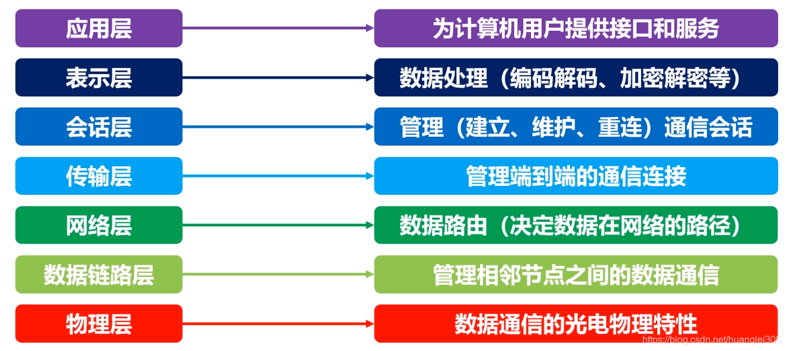
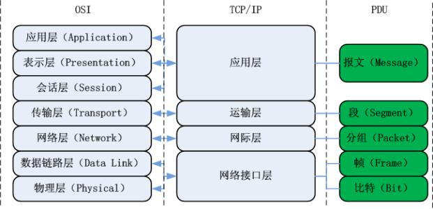

### script标签放head和body有什么区别？

**head中的script:**当浏览器解析HTML文档时，它会首先遇到 `<head>` 中的 `<script>` 标签。因此，这些脚本会在文档的其他部分（包括 `<body>`）之前加载和执行。如果脚本较大或依赖于外部资源（如API调用），这可能会导致页面加载的延迟，因为浏览器必须等待脚本加载和执行完成后才能继续解析和渲染页面的其余部分。在 `<head>` 中的脚本执行时，DOM可能还没有完全加载和解析。因此，如果脚本尝试访问或修改尚未加载的DOM元素，可能会导致错误或不可预期的行为

**body中的script**:将 `<script>` 标签放在 `<body>` 的底部（通常是在关闭的 `</body>` 标签之前）可以确保在脚本执行之前，页面的大部分内容（如DOM元素）已经被加载和解析。这有助于避免由于脚本执行而阻塞页面渲染的问题。将脚本放在 `<body>` 的底部可以确保在脚本执行时，DOM已经完全加载和解析。这使得脚本能够安全地访问和修改页面上的任何DOM元素。

### async和defer属性区别？


**蓝色线代表网络读取，红色线代表执行时间，这俩都是针对脚本的；绿色线代表 HTML 解析。**

1.async和defer都会在加载和渲染后续文档元素的过程将和 `script.js` 的加载并行进行（异步）

2.async会在script加载完后立即执行脚本，defer会等待文档元素加载完后再执行脚本。

### 页面加载过程中js文件会不会阻塞DOM的构建

js文件在以下的两种情况下会阻塞DOM的构建

- JavaScript文件被放置在head标签内部

- JavaScript代码修改了DOM结构

  js代码执行时，如果对DOM结构进行了修改，那么浏览器需要重排（reflow）和重绘（repaint），这个过程会较为耗时，并且会阻塞DOM和CSSOM的构建。

  以下两种方法可以解决js文件阻塞DOM的构建

- 通过设置 script 标签的 async 、defer 属性避免阻塞DOM和CSSOM的构建

- Web Workers ：Web Workers 是一种运行在后台线程的JavaScript脚本，它不会阻塞DOM和CSSOM的构建，并且可以利用多核CPU提高JavaScript代码执行速度。

### css怎么隐藏元素，这些方法的区别

**display:none**

该元素及其所有子元素都不会在页面上显示，并且不会占据页面空间。

元素被完全移除，元素不会被渲染

**visibility:hidden**

元素会变为不可见，但它仍然会占据页面上的空间

元素的布局和渲染仍然会进行，只是元素本身不可见

元素上绑定的事件也无法触发

**opacity:0**

元素会完全透明，但仍然占据页面上的空间

元素的子元素也会变得透明

元素上绑定的事件仍然会触发

display:none会触发重排重绘，visibility:hidden和opacity:0只会触发重绘

transition对display和visibility是无效的，但是对opacity有效

### 回流（重排）和重绘

回流 (Reflow) 是指网页渲染引擎根据元素的尺寸、位置和显示属性来重新计算页面的排版和布局，是网页渲染过程中的一个重要步骤。重绘 (Repaint) 是指网页渲染引擎根据显示属性 (如颜色、文字大小等) 重新绘制页面元素，不影响元素的位置和尺寸

**减少回流和重绘的方法**

- 移动调整元素时，使用 `transform`

- 使用 `opacity` 来改变元素的能见度

- 如果需要频繁重绘或回流的节点，可以透过

   

  ```
  will-change
  ```

   

  设定成独立的图层，因为独立的图层可以避免该节点渲染行为影像到其他节点。

  ```css
  body > .sidebar {
    will-change: transform;
  }
  ```

- 避免频繁用 JavaScript 操作 DOM 节点

### promise的理解（细节promise.then的第二个参数和.catch的区别，.catch后面再then还会执行吗？promise的值穿透）

`Promise` 是 JavaScript 中的一个对象，用于处理异步操作和值/错误传递。让我们逐一解析您提到的几个关键点。

**1. `promise.then` 的第二个参数**

`promise.then()` 方法接受两个参数：

1. 第一个参数是当 `Promise` 被解决（fulfilled）时调用的函数。
2. 第二个参数是（可选的）当 `Promise` 被拒绝（rejected）时调用的函数。

这是一个例子：

```javascript
let promise = new Promise((resolve, reject) => {  
    // 模拟异步操作  
    setTimeout(() => {  
        if (/* 某些条件 */) {  
            resolve('操作成功');  
        } else {  
            reject('操作失败');  
        }  
    }, 1000);  
});  
  
promise.then(  
    result => console.log(result), // 当 Promise 被解决时执行  
    error => console.log(error)    // 当 Promise 被拒绝时执行  
);
```

但通常，我们更倾向于使用 `.catch()` 来处理错误，因为它使得错误处理更加明显和集中。

**2. `.catch` 和 `.then` 的区别**

`.catch()` 是 `.then(null, rejectionHandler)` 的语法糖，它专门用于处理 `Promise` 的拒绝情况。`.catch()` 总是返回一个新的 `Promise`，这使得错误处理可以链式地进行。

使用 `.catch()` 的一个好处是，你可以确保所有的错误都被捕获，而不仅仅是直接跟在 `.then()` 后面的拒绝处理函数。

**3.`.catch` 后面再 `.then` 还会执行吗？**

是的，`.catch()` 后面再链式调用 `.then()` 是会执行的。因为 `.catch()` 会返回一个新的 `Promise`，而这个新的 `Promise` 可以被进一步处理（例如，使用 `.then()`）。

```javascript
promise  
    .catch(error => {  
        console.error('捕获到错误:', error);  
        // 你可以选择在这里处理错误，或者只是记录它，然后返回一个新的值或另一个 Promise  
        return '错误已处理';  
    })  
    .then(result => {  
        // 这里的 result 可能是 promise 被解决时的值，或者是 .catch() 中返回的值  
        console.log(result);  
    });
```

**4. Promise 的值穿透**

在 `Promise` 链中，如果一个处理程序（无论是 `.then()` 的解决处理程序还是 `.catch()` 的拒绝处理程序）返回一个值（而不是另一个 `Promise`），那么这个值会被“穿透”到下一个 `.then()` 的解决处理程序中。这叫做值穿透。

但如果处理程序返回一个 `Promise`，那么链会等待这个新的 `Promise` 解决或拒绝，然后才会继续到下一个 `.then()` 或 `.catch()`。

### async和await和promise的关联，怎么实现的？，generator的理解（中断和恢复怎么实现？）

**async/await 和 Promise 的关联及实现**

`async/await` 是建立在 `Promise` 基础上的语法糖，用于简化异步编程的复杂性。`async` 函数总是返回一个 `Promise`，而 `await` 只能在 `async` 函数内部使用，用于等待一个 `Promise` 解决（fulfilled）或拒绝（rejected）。

**实现原理：**

1. async 函数：
   - 当一个函数被声明为 `async` 时，它返回的是一个 `Promise` 对象。
   - 函数体中的 `return` 语句返回的值会被 `Promise.resolve()` 包裹，成为 `Promise` 的解决值。
   - 如果函数体中的代码抛出一个错误，`Promise` 会被拒绝，错误会被 `Promise.reject()` 包裹。
2. await 表达式：
   - `await` 等待一个 `Promise`。它暂停 `async` 函数的执行，直到 `Promise` 解决或拒绝。
   - 如果 `Promise` 被解决，`await` 表达式的值就是 `Promise` 的解决值。
   - 如果 `Promise` 被拒绝，`await` 会抛出错误，可以在 `async` 函数中通过 `try/catch` 捕获。

**示例：**

```javascript
async function fetchData() {  
  try {  
    const response = await fetch('https://api.example.com/data');  
    const data = await response.json();  
    return data;  
  } catch (error) {  
    console.error('Error fetching data:', error);  
    throw error; // 如果需要的话，可以将错误传递给上层的调用者  
  }  
}  
  
// 调用 fetchData 函数，它会返回一个 Promise  
fetchData().then(data => console.log(data))  
  .catch(error => console.error('Error:', error));
```

**Generator 的理解及中断和恢复的实现**

`Generator` 是一种特殊的函数，它允许你暂停和恢复函数的执行。`Generator` 函数通过 `function*` 语法声明，并使用 `yield` 关键字来暂停和恢复执行。

**中断和恢复的实现：**

1. **中断**：当 `Generator` 函数中执行到 `yield` 表达式时，它会返回一个迭代器对象。此时，函数执行被中断，控制权交还给调用者。
2. **恢复**：调用者可以调用迭代器的 `next()` 方法来恢复 `Generator` 函数的执行。`next()` 方法会返回一个对象，该对象有两个属性：`value`（`yield` 表达式的值）和 `done`（一个布尔值，表示 `Generator` 函数是否已经结束）。

**示例：**

```javascript
function* generatorFunction() {  
  console.log('Start');  
  yield 'First yield';  
  console.log('Middle');  
  yield 'Second yield';  
  console.log('End');  
}  
  
const iterator = generatorFunction();  
  
console.log(iterator.next().value); // 输出: Start，然后 First yield  
console.log(iterator.next().value); // 输出: Middle，然后 Second yield  
console.log(iterator.next().value); // 输出: End，然后 undefined（因为 done 为 true）
```

在上面的示例中，你可以看到 `Generator` 函数是如何通过 `yield` 表达式中断执行，并通过调用 `next()` 方法恢复执行的。每次调用 `next()` 时，函数都会从上次 `yield` 的位置继续执行，直到遇到下一个 `yield` 或函数结束。

### for in和for of的使用和区别（of能拿到的值）

在JavaScript中，`for...in`和`for...of`是两种常用的循环遍历数组（以及类数组对象）或对象的方法，但它们的使用场景和能获取到的值有所不同。

**1.`for...in`**

`for...in`循环用于遍历对象的可枚举属性（包括从原型链上继承的属性）。其基本语法如下：

```javascript
for (let key in object) {  
    // 在这里，key 是对象的属性名  
    let value = object[key]; // 通过属性名获取属性值  
    // ...  
}
```

**注意**：由于`for...in`会遍历对象及其原型链上的所有可枚举属性，因此通常不推荐用于遍历数组，除非你确定要遍历数组的所有可枚举属性（包括继承自`Array.prototype`的属性）。

**2.`for...of`**

`for...of`循环用于遍历可迭代对象（如Array，Map，Set，String，TypedArray，函数的arguments对象等等）的元素。其基本语法如下：

```javascript
for (let value of iterable) {  
    // 在这里，value 是可迭代对象的元素值  
    // ...  
}
```

**注意**：`for...of`循环只能用于可迭代对象。对于普通对象，由于其不是可迭代对象，所以不能直接使用`for...of`循环进行遍历。

**示例**

```javascript
let arr = [1, 2, 3];  
let obj = { a: 1, b: 2, c: 3 };  
  
// 使用for...in遍历数组（不推荐）  
for (let key in arr) {  
    console.log(key); // 输出：0, 1, 2（数组索引）  
    console.log(arr[key]); // 输出：1, 2, 3（数组元素值）  
}  
  
// 使用for...in遍历对象  
for (let key in obj) {  
    console.log(key); // 输出：a, b, c（对象属性名）  
    console.log(obj[key]); // 输出：1, 2, 3（对象属性值）  
}  
  
// 使用for...of遍历数组  
for (let value of arr) {  
    console.log(value); // 输出：1, 2, 3（数组元素值）  
}  
  
// 尝试使用for...of遍历对象（会报错）  
// for (let value of obj) { ... } // TypeError: obj is not iterable
```

**总结**

- `for...in`遍历的是对象的属性名，可以通过属性名获取属性值。
- `for...of`遍历的是可迭代对象的元素值。
- `for...in`不仅遍历对象自身的属性，还会遍历其原型链上的属性（除非使用`hasOwnProperty`等方法进行过滤）。
- `for...of`只能用于可迭代对象，不能用于普通对象。

### 类数组，转换为数组怎么实现

类数组（array-like objects）是那些具有数值索引和 `length` 属性的对象，但它们并不是真正的数组（Array）。在JavaScript中，常见的类数组对象包括函数的 `arguments` 对象、`NodeList` 对象（来自DOM查询）等。

将类数组对象转换为真正的数组有多种方法，以下是其中的几种：

1. **使用`Array.prototype.slice.call()`**

这是早期在JavaScript中转换类数组对象到数组的常见方法。

```javascript
function convertToArray(arrayLike) {  
    return Array.prototype.slice.call(arrayLike);  
}  
  
// 使用示例  
var args = convertToArray(arguments);
```

1. **使用`Array.from()`**

`Array.from()` 方法是ES6中新增的，它创建了一个新的数组实例，从一个类数组对象或可迭代对象。

```javascript
function convertToArray(arrayLike) {  
    return Array.from(arrayLike);  
}  
  
// 使用示例  
var nodeList = document.querySelectorAll('div');  
var arrayFromNodeList = convertToArray(nodeList);
```

1. **使用扩展运算符（Spread Operator）`...`**

扩展运算符也可以用来将类数组对象或可迭代对象转换为数组。

```javascript
function convertToArray(arrayLike) {  
    return [...arrayLike];  
}  
  
// 使用示例  
var args = convertToArray(arguments);
```

请注意，虽然扩展运算符和 `Array.from()` 方法在大多数情况下都可以很好地工作，但它们可能无法正确处理那些没有实现迭代器协议（iterator protocol）的类数组对象。对于这些对象，`Array.prototype.slice.call()` 可能是更可靠的选择。但是，在现代的JavaScript开发中，推荐使用 `Array.from()` 或扩展运算符，因为它们更简洁且易于阅读。

### 图片懒加载怎么实现的（js实现，设置display：none图片会加载吗？（会加载））

图片懒加载（Lazy Loading）是一种优化网页性能的技术，它允许浏览器在滚动页面到特定区域时才加载图片，而不是一次性加载页面上的所有图片。这对于有大量图片或图片较大的网页特别有用，因为它可以减少初始加载时间，并节省带宽。

以下是一个基本的JavaScript实现图片懒加载的示例：

1. **HTML**：首先，你需要在图片元素上添加一个特定的类名或数据属性，以便JavaScript可以选择它们。

```html
  
  
<!-- 更多图片... -->
```

注意，我们使用了`data-src`而不是`src`来存储图片的URL。这是因为当`src`属性被设置时，浏览器会立即尝试加载图片。

1. **CSS**：对于懒加载的图片，你可以使用`display: none;`或`opacity: 0;`等样式来隐藏它们，但这不会影响图片的加载。重要的是要确保图片的`src`属性没有设置，或者设置为一个占位符。

```css
.lazy {  
    display: none; /* 或者 opacity: 0; */  
    /* 其他样式... */  
}  
  
.lazy.loaded {  
    display: block; /* 如果之前设置了display: none; */  
    opacity: 1; /* 如果之前设置了opacity: 0; */  
    /* 其他样式... */  
}
```

1. **JavaScript**：在JavaScript中，你可以使用`Intersection Observer API`（如果浏览器支持）或滚动事件监听器来实现懒加载。

使用`Intersection Observer API`的示例：

```javascript
// 选择所有需要懒加载的图片  
const lazyImages = [].slice.call(document.querySelectorAll("img.lazy"));  
//类数组转化为数组等价于Array.prototype.slice.call(document.querySelectorAll("img.lazy"))
if ("IntersectionObserver" in window) {  
    let lazyImageObserver = new IntersectionObserver(function(entries, observer) {  
        entries.forEach(function(entry) {  
            if (entry.isIntersecting) {  
                // 当图片进入视口时，加载图片  
                let lazyImage = entry.target;  
                lazyImage.src = lazyImage.dataset.src;  
                lazyImage.classList.add("loaded");  
                lazyImageObserver.unobserve(lazyImage);  
            }  
        });  
    });  
  
    lazyImages.forEach(function(lazyImage) {  
        lazyImageObserver.observe(lazyImage);  
    });  
}
```

在这个示例中，我们首先选择了所有带有`lazy`类的图片。然后，我们创建了一个新的`IntersectionObserver`实例，并传递了一个回调函数来处理与视口交叉的图片。当图片进入视口时，我们将`data-src`的值设置为`src`，并将图片标记为已加载。最后，我们停止观察已加载的图片。

请注意，`Intersection Observer API`在旧版浏览器中可能不受支持。在这种情况下，你可以使用滚动事件监听器和`getBoundingClientRect()`方法来实现类似的功能。但是，这种方法可能会更加复杂，并且可能导致性能问题。

### vue中watch和created哪个先执行？

watch在created钩子函数执行之后初始化，created总是先于watch中的任何回调执行。

### vue组件通信方式有哪些？

Vue组件通信的方式有多种，下面将清晰地分点表示并归纳这些方式：

1. props 和 $emit
   - 父组件通过props向子组件传递数据。
   - 子组件通过$emit触发事件，向父组件传递数据。
   - 这是Vue中最基本的父子组件通信方式。
2. *re**f**s*和children
   - 父组件可以通过$refs直接访问子组件的实例和数据。
   - 父组件也可以通过$children访问其子组件的集合，并进而访问子组件的属性和方法。
3. *a**tt**rs*和listeners
   - $attrs包含了父作用域中未被子组件props接收的属性（class和style除外）。
   - *l**i**s**t**e**n**ers*包含了父作用域中的*v*−on事件监听器，可以通过*v*−on="listeners"传入内部组件。
   - 这两种方式常用于多层嵌套组件传递数据。
4. provide 和 inject
   - provide/inject主要用于祖先组件向子孙组件传递数据。
   - provide在祖先组件中定义，inject在子孙组件中注入。
5. Event Bus (事件总线)
   - 主要用于无父子关系的组件之间传值，如兄弟组件之间。
   - 通过创建一个新的Vue实例作为事件中心，组件可以注册监听事件或触发事件。
6. vue-router
   - 在路由切换时，可以通过路由的props、query或params等属性来传递数据。
7. Vuex
   - Vuex是一个专为Vue.js应用程序开发的状态管理模式。
   - 它采用集中式存储管理应用的所有组件的状态，并以相应的规则保证状态以一种可预测的方式发生变化。
8. slot作用域插槽
   - 允许父组件将模板插入到子组件的插槽中，并通过作用域插槽向子组件传递数据。
9. root和parent
   - $root用于访问根组件实例。
   - $parent用于访问父组件实例。

以上这些方式涵盖了Vue组件间通信的主要场景，可以根据具体需求选择合适的方式进行通信。

### Wepack和Vite构建区别，为什么vite快

webpack会先打包，然后启动开发服务器，请求服务器时直接给予打包结果。
而vite是直接启动开发服务器，请求哪个模块再对该模块进行实时编译。
由于现代浏览器本身就支持ES Module，会自动向依赖的Module发出请求。vite充分利用这一点，将开发环境下的模块文件，就作为浏览器要执行的文件，而不是像webpack那样进行打包合并。
由于vite在启动的时候不需要打包，也就意味着不需要分析模块的依赖、不需要编译，因此启动速度非常快。当浏览器请求某个模块时，再根据需要对模块内容进行编译。这种按需动态编译的方式，极大的缩减了编译时间，项目越复杂、模块越多，vite的优势越明显。
在HMR（热更新）方面，当改动了一个模块后，仅需让浏览器重新请求该模块即可，不像webpack那样需要把该模块的相关依赖模块全部编译一次，效率更高。
当需要打包到生产环境时，vite使用传统的rollup（也可以自己手动安装webpack来）进行打包，因此，vite的主要优势在开发阶段。另外，由于vite利用的是ES Module，因此在代码中（除了vite.config.js里面，这里是node的执行环境）不可以使用CommonJS

### 手写题1


```javascript
function fn(tree, targetId, key = "id") {
  let result = [];
  function pushChildren(node) {
    if (node.children) {
      for (const child of node.children) {
        result.push(child[key]);
        if (child.children) {
          pushChildren(child);
        }
      }
    }
  }
  function traverse(nodes) {
    for (const node of nodes) {
      if (node[key] === targetId) {
        if (node.children) {
          pushChildren(node);
        }
      } else if (node.children) {
        traverse(node.children); // 继续遍历其他节点的子节点
      }
    }
  }

  traverse(tree);
  return result;
}
```

### 为什么不用 cookie 用 token

在Web开发中，选择使用令牌（token）而不是cookie来管理用户会话和身份验证有多个原因。以下是一些主要的原因：

1. 无状态（Stateless）：
   - 使用令牌通常意味着你的应用程序是无状态的，因为所有的认证信息都包含在令牌本身中，而不需要在服务器上存储会话信息。这使得应用程序更容易扩展，因为服务器不需要跟踪每个用户的会话状态。
2. 安全性：
   - Cookie通常存储在客户端的浏览器中，并且可以通过HTTP请求自动发送。这可能导致安全问题，例如跨站脚本攻击（XSS），因为攻击者可能会尝试窃取或篡改cookie。
   - 令牌（特别是JWT，即JSON Web Tokens）通常存储在HTTP请求的头部（如`Authorization`头），这使得它们更难以被窃取。此外，令牌可以包含签名，用于验证其完整性和真实性。
3. 灵活性：
   - 令牌可以包含有关用户的自定义信息，这些信息可以在不需要再次查询数据库的情况下使用。
   - 令牌可以在多个服务和应用程序之间共享，这使得它们成为微服务架构和分布式系统中的理想选择。
4. 过期和撤销：
   - 虽然cookie可以设置过期时间，但撤销一个已经发布的cookie相对困难，因为你需要更改存储在客户端的cookie。
   - 令牌通常具有较短的过期时间，并且可以通过黑名单或白名单机制进行撤销。当令牌过期或需要撤销时，服务器只需简单地停止接受该令牌即可。
5. 跨域（CORS）：
   - 由于cookie的发送受到同源策略的限制，因此跨域身份验证可能变得更加复杂。而令牌通常存储在HTTP请求头中，可以更容易地跨域发送。
6. 移动和桌面应用：
   - 对于移动和桌面应用程序，使用令牌而不是cookie更为常见，因为这些应用程序通常不依赖于浏览器来管理cookie。
7. RESTful API：
   - RESTful API通常设计为无状态的，以便更好地支持缓存、可伸缩性和可靠性。使用令牌与RESTful API的设计原则相契合。

当然，这并不是说cookie在所有情况下都是不好的选择。在某些情况下，cookie可能是更合适的选择，特别是当你需要跨多个请求和页面持久化会话信息时。但是，在需要高安全性、可扩展性或跨域身份验证的场景中，令牌通常是一个更好的选择。

### session cookie token的区别

Session、Cookie和Token在Web开发中各有其独特的作用和区别，以下是它们之间的主要差异：

1. 存储位置：
   - Session：数据存储在服务器端，具体是服务器为每个用户会话创建的临时对象。
   - Cookie：数据存储在客户端，即用户的计算机上，是由服务器发送到用户浏览器并存储的小文本文件。
   - Token：通常在客户端存储，但在客户端和服务器端之间传递，用于身份验证和授权。
2. 安全性：
   - Session：相对安全，因为数据存储在服务器端，不易被恶意攻击者获取。
   - Cookie：存在安全风险，因为存储在客户端，可能被拦截或篡改。
   - Token：安全性较高，可以使用加密算法进行签名，确保信息不被篡改。但需注意客户端存储可能带来的风险。
3. 性能使用：
   - Session：存储在服务器上，随着访问增多会占用服务器的性能。
   - Cookie：存储在客户端，不占用服务器资源，但存在大小限制（通常不超过4KB）。
   - Token：无状态性使得服务器不需要保存会话状态，从而减轻了服务器的负担。
4. 数据大小：
   - Session：没有数据大小的限制，但其存储空间取决于服务器的内存大小。
   - Cookie：数据大小有限制，通常不超过4KB。
   - Token：大小取决于所使用的加密算法和安全认证协议。
5. 跨域性：
   - Session：与域名绑定，不支持跨域。
   - Cookie：同样受到同源策略的限制，跨域访问可能更复杂。
   - Token：支持跨域访问，通常将token置于请求头中。
6. 用途：
   - Session：适用于需要跟踪用户状态的场景，如购物车功能、表单提交等。
   - Cookie：常用于保持用户的登录状态、记住用户的偏好设置等。
   - Token：适用于需要验证用户身份和授权的场景，如API访问控制、单点登录（SSO）等。
7. 生命周期：
   - Session：生命周期与浏览器会话相同，即用户关闭浏览器时Session将被删除。
   - Cookie：可以设置特定的生命周期，超过设定时间后将被删除。
   - Token：通常具有较短的过期时间，并可以通过黑名单或白名单机制进行撤销。
8. 管理：
   - Session：由服务器管理，需要服务器资源来存储和检索。
   - Cookie：由浏览器管理，但服务器可以设置其属性和生命周期。
   - Token：由客户端和服务器共同管理，服务器验证token的有效性，客户端负责存储和传递。

综上所述，Session、Cookie和Token在Web开发中各有其优缺点和适用场景。选择使用哪种机制取决于具体的应用需求、安全要求和性能考虑。

### 懒加载和按需加载的区别

懒加载（Lazy Loading）和按需加载（On-Demand Loading）在前端性能优化中都起着重要的作用，但它们在具体的应用和原理上存在一些差异。以下是对它们之间的区别进行的分析：

1. 定义与概念：
   - 懒加载：也称为延迟加载，是一种优化网页性能的方法。它的核心思想是：在页面加载时，仅加载当前可见或即将可见的内容，当用户滚动或触发其他事件时，再加载其他部分的内容。这主要用于图片、视频等媒体资源以及大型组件或路由页面。
   - 按需加载：允许在需要时动态加载资源，而不是在页面初次加载时将所有资源都下载下来。它更关注资源的加载时机，适用于大型单页面应用（SPA）等场景。
2. 应用场景：
   - 懒加载：常用于图片、视频以及需要滚动页面才能看到的内容。这种技术有助于页面在开始时只加载必要的内容，当用户需要查看其他部分时再进行加载，从而减少初始加载时间。
   - 按需加载：适用于在应用程序中动态加载特定的代码块或模块。通过按需加载，只有在用户执行某些操作或导航到特定页面时，与该页面相关的代码和数据才会被下载和执行。
3. 实现原理：
   - 懒加载：利用用户行为监测，如滚动、点击等，将页面中的资源（如图片）的加载时机推迟至用户需要时。这通常通过监听滚动事件或Intersection Observer API来判断资源是否进入可视区域，进而决定是否加载。
   - 按需加载：在现代JavaScript中，可以使用动态`import()`函数来实现按需加载。这使得开发者可以在运行时根据需要异步加载模块。在React中，可以使用`React.lazy()`和`<Suspense>`组件来实现组件级别的懒加载。
4. 特点与优势：
   - 懒加载：通过延迟加载页面内容或资源，能够提升页面加载速度、减少数据传输量，并优化用户体验。它特别适用于长页面或包含大量资源的页面。
   - 按需加载：更灵活，可以根据具体需求动态加载任何模块或代码块。这有助于减少初始加载时间，特别是对于大型组件或应用程序中的路由页面。通过延迟加载不是立即需要的组件，可以加快初始加载速度并改善用户体验。
5. 总结：
   - 懒加载和按需加载都是前端性能优化的重要手段，但它们在应用场景、实现原理和特点上有所不同。懒加载更侧重于页面内容的延迟加载，而按需加载则更关注资源的动态加载时机。在实际开发中，可以根据项目的具体需求选择合适的优化策略。

### 说一说你对Cookie localStorage sessionStorage的理解

Cookie、localStorage 和 sessionStorage 都是在客户端存储数据的技术，但它们之间有一些关键的区别：

1. **Cookie**：
   - Cookie 最初是为了在客户端保存用户会话信息而设计的，它们可以在客户端和服务器之间进行传递。
   - Cookie 的大小限制为 4KB 左右，因此不适合存储大量数据。
   - Cookie 有一个有效期，可以设置为特定的时间长度。过期后，Cookie 会被自动删除。
   - Cookie 可能面临安全风险，如跨站请求伪造（CSRF）攻击。因此，在使用 Cookie 时需要采取一定的安全措施。
   - 因为每次 HTTP 请求都会携带 Cookie，所以频繁操作 Cookie 可能会影响性能。
2. **localStorage**：
   - localStorage 是 HTML5 引入的一种客户端存储技术，允许在用户的浏览器中存储较大量的数据（通常为 5-10MB，根据浏览器实现有所不同）。
   - localStorage 中存储的数据没有有效期，会一直保留，除非用户手动清除或者使用代码进行删除。
   - localStorage 只在客户端进行操作，不会与服务器进行通信。
   - localStorage 的数据存储在同一个域名下，不同域名之间的 localStorage 数据是隔离的。
3. **sessionStorage**：
   - sessionStorage 与 localStorage 非常相似，它们都是 HTML5 引入的客户端存储技术，具有相同的存储容量限制。
   - 与 localStorage 不同的是，sessionStorage 的数据仅在当前浏览器标签或窗口的生命周期内有效。当用户关闭标签或窗口时，sessionStorage 中的数据会被自动清除。
   - sessionStorage 同样只在客户端进行操作，不会与服务器进行通信。
   - sessionStorage 的数据同样存储在同一个域名下，不同域名之间的 sessionStorage 数据是隔离的。

总之，Cookie、localStorage 和 sessionStorage 都是客户端存储技术，但它们之间在数据有效期、存储容量和与服务器通信等方面有所不同。根据具体需求和场景，开发者可以选择合适的技术进行数据存储。

### html解析过程

1. 处理HTML标记并构建DOM树。
2. 处理CSS标记并构建CSSOM树。
3. 将DOM与CSSOM合并成一个渲染树。
4. 根据渲染树来布局，计算每个节点的布局信息。
5. 将各个节点绘制到屏幕上。

### 浏览器输入链接后发生了什么

- 浏览器的地址栏输入URL并按下回车。

- 浏览器查找当前URL是否存在缓存，并比较缓存是否过期。

- DNS解析URL对应的IP。

- 根据IP建立TCP连接（三次握手）。

- HTTP发起请求。

- 服务器处理请求，浏览器接收HTTP响应。

- 渲染页面，构建DOM树。

- 关闭TCP连接（四次挥手）。

### 状态码

在Web开发中，状态码是用于表示HTTP请求响应状态的数字代码。虽然HTML5本身并不直接涉及HTTP状态码的定义，但它们是Web开发中不可或缺的一部分，特别是在使用HTML5构建的应用程序中与服务器进行交互时。

以下是一些常见的HTTP状态码及其描述（注意，这些状态码并非HTML5特有，而是HTTP标准的一部分）：

**1xx（信息性状态码）**

- **100 Continue**：客户端应当继续发送请求或忽略这个响应。

**2xx（成功状态码）**

- **200 OK**：请求成功。一般用于GET与POST请求。
- **201 Created**：请求已经被创建，且新的资源已经成功创建并完成了请求的URI已经随Location的头信息返回。
- **204 No Content**：服务器成功处理了请求，但不需要返回任何实体内容，并且希望返回更新了的元信息。

**3xx（重定向状态码）**

- **301 Moved Permanently**：请求的网页已永久移动到新位置。
- **302 Found**（或**307 Temporary Redirect**）：临时重定向。

**4xx（客户端错误状态码）**

- **400 Bad Request**：服务器无法理解请求的格式，客户端不应当尝试再次使用相同的内容发起请求。
- **401 Unauthorized**：请求未授权。
- **403 Forbidden**：服务器已经理解请求，但是拒绝执行它。
- **404 Not Found**：服务器无法根据客户端的请求找到资源（网页）。

**5xx（服务器错误状态码）**

- **500 Internal Server Error**：服务器内部错误，无法完成请求。
- **502 Bad Gateway**：作为网关或代理工作的服务器尝试执行请求时，从上游服务器接收到无效的响应。
- **503 Service Unavailable**：由于临时的服务器维护或者过载，服务器当前无法处理请求。

### 事件循环的理解

同步任务进入主线程，即主执行栈，异步任务进入任务队列，主线程内的任务执行完毕为空，会去任务队列读取对应的任务，推入主线程执行。上述过程的不断重复就事件循环

**同步任务：** 在主线程上排队执行的任务，只有前一个任务执行完毕，才能执行后一个任务。是**由 js 执行栈/回调栈执行**的

**异步任务：** 不进入主线程、而进入任务队列的任务，当主线程中的任务运行完成了，才会从任务队列中取出异步任务，放入主线程中执行，分为**宏任务**和**微任务**

执行顺序：同步任务>微任务 >宏任务

#### 宏任务

宏任务是**由宿主环境发起**的，比如浏览器、Node等，宏任务的异步代码有：

- script（代码块）

- setTimeout / setInterval 定时器

- setImmediate 定时器

- ......等等

#### 微任务

微任务是**由JS引擎发起**的，微任务的异步代码有：

- process.nextTick (node)

- Promise.then( )/catch( ) 。注意，**`Promise`本身同步，只是它里面的`then/catch`的回调函数是异步的微任务**

- Async/Await

- Object.observe

- ......等等

### 什么是闭包？

闭包是指一个函数可以访问另一个函数作用域内的变量。当一个函数嵌套在另一个函数中时，内部函数可以访问外部函数的变量，即使外部函数已经返回了。这种情况下，内部函数形成了一个闭包，它保留了外部函数的作用域链并可以继续访问这些变量。闭包常常用于实现函数的封装和私有化，以及在回调和事件处理等场景下的数据共享与传递。(例如VUE中写的hooks，只暴露里面的函数)

### http和https的区别

HTTP和HTTPS的主要区别体现在以下几个方面：

1. 安全性：
   - HTTP：以明文方式发送内容，不提供任何方式的数据加密。这意味着如果攻击者截取了Web浏览器和网站服务器之间的传输报文，就可以直接读懂其中的信息。因此，HTTP协议不适合传输一些敏感信息，如信用卡号、密码等支付信息。
   - HTTPS：在HTTP的基础上加入了SSL/TLS协议，依靠证书来验证服务器的身份，并为浏览器和服务器之间的通信加密。HTTPS协议的主要作用包括建立一个信息安全通道来保证数据传输的安全以及确认网站的真实性。
2. 默认端口：
   - HTTP：默认使用80端口。
   - HTTPS：默认使用443端口。
3. 连接方式：
   - HTTP：连接很简单，是无状态的。
   - HTTPS：由SSL/TLS+HTTP协议构建的可进行加密传输、身份认证的网络协议，比HTTP协议更安全。
4. 网站申请流程：
   - HTTP：不需要申请证书。
   - HTTPS：需要到CA申请证书，一般免费证书较少，因而需要一定费用。
5. 性能影响：
   - HTTPS：虽然增加了数据传输的安全性，但其握手阶段比较费时，可能会使页面的加载时间延长近50%，并增加10%到20%的耗电。此外，HTTPS连接缓存不如HTTP高效，会增加数据开销和功耗。
6. 应用场景：
   - HTTP：适用于不需要高度安全性的数据传输场景，如简单的网页浏览等。
   - HTTPS：广泛用于需要安全敏感的通讯场景，如交易支付、个人信息登录等。
7. 加密技术：
   - HTTPS协议通过数字证书、加密算法、非对称密钥等技术完成互联网数据传输加密，实现互联网传输安全保护。其安全基础是SSL/TLS协议。

总结来说，HTTPS相较于HTTP在安全性方面有了极大的提升，通过加密和身份验证机制确保了数据传输的机密性和完整性。然而，HTTPS也带来了一定的性能开销和额外的费用。因此，在选择使用HTTP还是HTTPS时，需要根据实际的应用场景和需求进行权衡。

### TCP中三次握手和四次挥手的含义

在 TCP（传输控制协议）中，三次握手和四次挥手是用来建立和终止连接的重要过程。下面分别解释它们的含义：

**三次握手（Three-Way Handshake）**：

三次握手是建立 TCP 连接的过程，确保数据传输的可靠性和连接的双向通信。这个过程包含三个步骤：

1. 客户端向服务器发送一个 SYN（同步）报文，表示客户端希望建立连接。报文中包含一个随机生成的序列号（Sequence Number）。
2. 服务器收到 SYN 报文后，回复一个 SYN+ACK（同步确认）报文，其中 ACK 的值为客户端序列号加一。同时，服务器也会发送一个自己的随机序列号。
3. 客户端收到 SYN+ACK 报文后，发送一个 ACK（确认）报文给服务器，其中 ACK 的值为服务器序列号加一。

完成这三个步骤后，客户端和服务器之间的 TCP 连接就建立好了，可以进行双向通信。

**四次挥手（Four-Way Handshake）**：

四次挥手是终止 TCP 连接的过程。当数据传输完成后，客户端和服务器需要通过四次挥手来关闭连接。这个过程包含四个步骤：

1. 客户端发送一个 FIN（完成）报文给服务器，表示客户端已完成数据发送。
2. 服务器收到 FIN 报文后，回复一个 ACK（确认）报文给客户端，表示已收到客户端的关闭请求。此时，客户端到服务器的连接被关闭，但服务器到客户端的连接仍然存在。
3. 当服务器完成数据发送后，也会发送一个 FIN 报文给客户端，表示服务器准备关闭连接。
4. 客户端收到服务器的 FIN 报文后，回复一个 ACK 报文给服务器，表示已收到服务器的关闭请求。经过一段时间（通常为 2MSL，即最长报文段寿命的两倍）后，客户端关闭与服务器的连接。

完成这四个步骤后，客户端和服务器之间的 TCP 连接就被完全关闭了。

### SSL/TLS是什么？

SSL/TLS是一种用于保护网络通信的协议，它通过加密和身份验证机制确保数据在传输过程中的安全性和完整性。以下是关于SSL/TLS的详细解释：

一、定义

1. SSL（Secure Sockets Layer，安全套接字层）：是Netscape公司设计的一套协议，用于在应用程序（如浏览器）和Web服务器之间建立加密通信。它位于可靠的面向连接的网络层协议和应用层协议之间，是一种身份验证和加密的机制。
2. TLS（Transport Layer Security，传输层安全性）：是SSL的继任者，由IETF（Internet Engineering Task Force，互联网工程任务组）在SSL 3.0基础上设计。TLS提供了与SSL类似的功能，但更加安全，并包含更多的加密算法和身份验证机制。

二、工作原理

SSL/TLS协议的工作原理主要分为两个阶段：握手阶段和数据传输阶段。

1. 握手阶段：
   - 客户端向服务器发送加密通信请求。
   - 服务器回应并发送数字证书，该证书包含服务器的公钥和其他信息，用于证明服务器的身份。
   - 客户端验证数字证书的有效性，如果证书有效，则生成一个随机数，并使用服务器的公钥加密后发送给服务器。
   - 服务器使用自己的私钥解密客户端发送的随机数，并使用该随机数和自己的私钥生成会话密钥。
   - 双方确认握手过程完成，并开始使用会话密钥进行加密通信。
2. 数据传输阶段：
   - 使用会话密钥对数据进行加密和解密。发送方使用会话密钥对数据进行加密，并通过SSL/TLS协议传输给接收方。
   - 接收方使用会话密钥解密数据，确保数据的完整性和安全性。

三、特点

1. 加密性：SSL/TLS使用对称加密和非对称加密相结合的方式，保证了通信的安全性和数据的完整性。
2. 身份验证：通过数字证书和公钥/私钥机制，SSL/TLS可以验证通信双方的身份，防止中间人攻击。
3. 完整性：SSL/TLS使用消息认证码（MAC）等技术，确保传输数据的完整性和防止篡改。

四、应用场景

SSL/TLS广泛应用于需要保护数据传输安全性和完整性的场景，如：

1. Web浏览器与服务器之间的安全通信（如HTTPS协议）。
2. 电子邮件服务的加密传输（如SMTPS、IMAPS）。
3. 在线支付系统的安全保护。
4. 虚拟专用网络（VPN）的加密通信。
5. API接口的安全通信。
6. 数据库系统的加密连接等。

总之，SSL/TLS是一种重要的网络通信安全协议，它通过加密和身份验证机制确保数据在传输过程中的安全性和完整性。

### 为什么vue2的data是一个函数？

1.vue中组件是用来复用的，为了防止data复用，将其定义为函数。

2.vue组件中的data数据都应该是相互隔离，互不影响的，组件每复用一次，data数据就应该被复制一次，之后，当某一处复用的地方组件内data数据被改变时，其他复用地方组件的data数据不受影响，就需要通过data函数返回一个对象作为组件的状态。

3.当我们将组件中的data写成一个函数，数据以函数返回值形式定义，这样每复用一次组件，就会返回一份新的data，拥有自己的作用域，类似于给每个组件实例创建一个私有的数据空间，让各个组件实例维护各自的数据。

4.当我们组件的data单纯的写成对象形式，这些实例用的是同一个构造函数，由于JavaScript的特性所导致，所有的组件实例共用了一个data，就会造成一个变了全都会变的结果。

### require 和 import 的区别

require和import在JavaScript中都是用于加载模块的方法，但它们之间存在一些显著的区别。以下是关于require和import区别的详细解释：

1. 规范与版本：
   - require是CommonJS规范的模块化语法，主要在Node.js环境中使用。
   - import是ECMAScript 6（ES6）规范的模块化语法，用于现代前端JavaScript开发中。
2. 加载时机：
   - require是运行时加载，即代码执行到require语句时才会加载并执行模块代码。
   - import是编译时加载，即在代码执行前，模块的代码已经被加载和编译。
3. 语法位置：
   - require可以写在代码的任意位置，只要确保在调用模块的代码之前即可。
   - import只能写在文件的最顶端，且不可在条件语句或函数作用域中使用。
4. 导出与值的变化：
   - require通过module.exports导出的值就不能再变化，是静态的。
   - import通过export导出的值可以改变，具有动态绑定的特性。
5. 导出方式：
   - require通过module.exports导出的是exports对象，可以包含多个属性和方法。
   - import通过export导出的是指定输出的代码，可以是单个值、多个值或默认导出。
6. 性能：
   - require运行时才引入模块的属性，所以性能相对较低。
   - import编译时引入模块的属性，性能稍高，因为它允许在编译时进行静态分析和优化。
7. 兼容性：
   - require在Node.js环境中被广泛支持，但在浏览器中需要额外的工具（如Browserify）来实现。
   - import在现代浏览器中得到了原生支持，但在Node.js中需要使用如Babel之类的转译器将ES6代码转换为ES5代码才能使用。
8. 语法差异：
   - 使用require时，通常将模块导出的内容赋值给一个变量，如`const module = require('module-name')`。
   - 使用import时，可以直接导入模块中导出的内容，如`import { functionName } from 'module-name'`。

总结来说，require和import的主要区别在于它们所属的规范、加载时机、语法位置、导出与值的变化、导出方式、性能、兼容性和语法差异。在选择使用哪种方式时，需要根据具体的开发环境和需求来决定。

### OSI模型和TCP/IP四层模型

**物理层（Physical Layer）**：负责实际的物理连接，如电缆、光纤等，以及数据的传输和接收。它关注的是比特流的传输。

**数据链路层（Data Link Layer）**：在物理层的基础上提供数据传输的可靠性。它负责建立、维护和解除物理链路，并对传输的数据进行错误检测和修正。

**网络层（Network Layer）**：负责数据包的路由和转发，确定数据包的路径，以及处理网络拥塞和路由选择等问题。

**传输层（Transport Layer）**：负责端到端的通信管理和错误恢复。它确保数据在网络中完整无误地传输。

**会话层（Session Layer）**：管理应用程序之间的会话，包括会话的建立、维护和终止。

**表示层（Presentation Layer）**：确保信息以通用的格式传输，进行数据的格式转换、数据加密和解密。

**应用层（Application Layer）**：直接为用户的应用程序提供服务，如Web浏览器、电子邮件客户端等。






### 防抖

```javascript
function debounce(fn, wait) {
  let timer = null;
  return function(arguments) {
    if(timer) {
      clearTimeout(timer);
      timer = null;
    }
    timer = setTimeout(() => {
      fn.apply(this, arguments);
    }, wait);
  }
}
```

### 节流

```javascript
function throttle(fn, delay) {
  let timer = null;
  return function (arguments) {
    if (timer) return;
    timer = setTimeout(() => {
      timer = null;
      return fn.apply(this, arguments);
    }, delay)
  }
}
```

### 性能优化

前端性能优化是提升网页加载速度、响应速度和用户体验的重要措施。以下是根据参考文章整理的前端性能优化方案，分点表示并归纳了主要方法：

**1. 静态资源优化**

- **合并与压缩文件**：合并CSS、JS文件，减少HTTP请求次数；压缩JS、CSS和图片文件，减少请求返回的数据量。
- **使用CDN**：通过CDN分发静态资源，客户端可以通过最佳的网络链路加载资源。
- **缓存机制**：设置静态资源的缓存策略，如Cache-Control和Expires属性，提高资源加载速度。
- **字体图标代替图片**：使用iconfont等字体图标代替图片图标，减少图片加载时间。

**2. 接口访问优化**

- **减少HTTP请求**：一个页面依赖的多个接口统一使用一个接口调用，减少页面接口请求数。
- **接口缓存策略**：实现接口缓存策略，减少不必要的接口请求。

**3. 页面渲染速度优化**

- **合理放置脚本位置**：CSS放在顶部优先渲染，JS放在底部避免阻塞。
- **减少DOM元素数量**：优化DOM结构，减少DOM元素数量，提高渲染效率。
- **图片懒加载**：对图片进行懒加载处理，避免页面打开时加载过多资源。
- **事件委托**：使用事件委托减少与DOM的交互次数，提高性能。
- **优化动画性能**：使用CSS3动画代替JS动画，减少重绘和回流；在GPU上渲染动画以提高性能。

**4. 代码优化**

- **JS代码优化**：将脚本置底加载，使用外部JS和CSS文件；去除重复脚本和代码，减少DOM访问。
- **CSS代码优化**：避免使用CSS表达式和filters；合并与压缩CSS文件；使用link代替@import。

**5. 图片优化**

- **优化图片大小**：使用适当的图片格式和压缩算法，减少图片文件大小。
- **雪碧图（CSS Sprites）**：将多个小图片合并成一个大图片，减少HTTP请求次数。
- **图片懒加载和预加载**：实现图片的懒加载和预加载策略，优化图片加载体验。

**6. 网络连接优化**

- **使用CDN**：如上所述，CDN可以优化网络连接的响应速度。
- **DNS预解析**：在浏览器访问域名时提前解析DNS，减少域名解析时间。
- **持久连接**：使用keep-alive或persistent建立持久连接，减少连接建立的开销。

**7. 资源加载优化**

- **异步加载**：使用async或defer属性异步加载JS脚本，避免阻塞页面渲染。
- **模块按需加载**：根据页面需求按需加载模块资源，减少不必要的资源加载。
- **资源预加载和预读取**：使用preload和prefetch提示浏览器提前加载资源。

**8.其他优化措施**

- **减少重绘和回流**：通过合理优化DOM操作减少页面的重绘和回流。
- **使用Web Worker**：对于计算密集型任务，使用Web Worker在后台线程中执行，避免阻塞UI线程。
- **使用合适的选择器**：在CSS中使用合适的选择器，提高选择元素的效率。

以上前端性能优化方案涵盖了从静态资源优化、接口访问优化到页面渲染速度优化等多个方面，通过综合应用这些优化措施，可以显著提升网页的性能和用户体验。

### 什么是CDN

CDN，全称Content Delivery Network，即内容分发网络。它是一种构建在现有网络基础之上的智能虚拟网络，通过部署在全球各地的边缘服务器，以及中心平台的负载均衡、内容分发、调度等功能模块，使用户能够就近获取所需内容，从而提高用户访问响应速度。

CDN的工作原理是，当用户访问某个网站时，CDN会根据用户的IP地址将请求转发到离用户最近的服务器。该服务器会将内容从源服务器中读取出来，并将其缓存到本地。下次用户访问该内容时，CDN会直接从本地服务器中返回内容，从而减少了从源服务器中传输内容所需的时间。