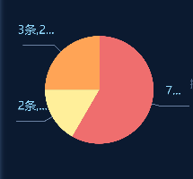
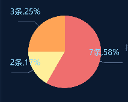

# echart饼图label超出容器边界解决方案

最近在开发中遇到了这个问题，在小小的一块空间里面，偏要用指引线在外面展示Label，Label的又很长，一不小心就超出边界了。

尝试使用在网络上找到的解决方法，在option的series.label里添加以下几个属性：

```javascript
series:[
{
	label:{
		position:'outer',
		alignTo:'edge',
		margin:50,
	},
}
]
```

效果如下：



Label不会超出边界了，但是Label超出的部分还是会被省略掉，这个可以通过在series饼图对应的配置中添加`avoidLabelOverlap: false`解决

```javascript
series:[
{
	name:'',
	type:'pie',
	radius:'60%',
	avoidLabelOverlap: false,
},
]
```

最终效果如下：



这样Label就不会超出边界和被省略了，但是会和饼图重叠，所以如果有更好的方法欢迎大家补充。