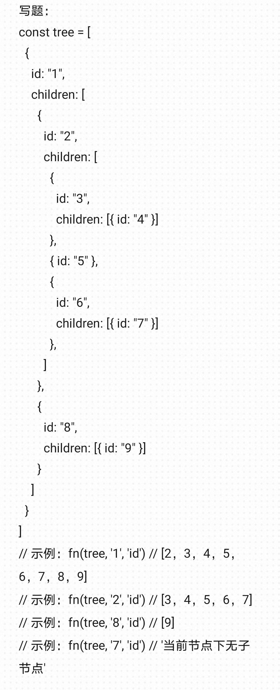

## 防抖

```javascript
function debounce(fn, wait) {
  let timer = null;
  return function() {
    if(timer) {
      clearTimeout(timer);
      timer = null;
    }
    timer = setTimeout(() => {
      fn.apply(this, arguments);
    }, wait);
  }
}
```

## 节流

```javascript
function throttle(fn, delay) {
  let timer = null;
  return function () {
    if (timer) return;
    timer = setTimeout(() => {
      timer = null;
      return fn.apply(this, arguments);
    }, delay)
  }
}
```

## 深拷贝与浅拷贝

**浅拷贝**指的是只复制对象或数组本身，而不复制它们内部引用的其他对象或数组。也就是说，浅拷贝会创建一个新的对象或数组，并将原始对象或数组中的元素复制到新的对象或数组中，但是这些元素仍然是原始对象或数组中元素的引用。

**深拷贝（Deep Copy）**是创建一个新的对象，该对象与原始对象完全独立，在内存中占据不同的位置。深拷贝会复制原始对象的所有属性和嵌套对象，并且对其中一个对象的修改不会影响到另一个对象。

#### 浅拷贝

##### 1.Object.create(obj)

```javascript
let obj1 = {
 name: '小明'
}
let obj2 = Object.create(obj1)
obj1.name = '小红'

console.log(obj1.name); // 输出 '小红'

```

##### 2.Object.assign({} , obj)

Object.assign({} ，obj) 方法会将所有可枚举的自有属性从一个或多个源对象复制到目标对象，并返回目标对象。该方法执行的是浅拷贝，因此如果源对象的属性值是基本类型数据，那么它们会被复制到目标对象中，这种数据类似深拷贝，改动目标对象不会印象原对象，如果是引用类型数据，则仅复制它们的引用，这种数据改动目标对象也会修改原对象中的值。

```javascript
    let obj = {
    name: '小明',
    like: {
        n: 'coding'
    }
}
let obj2 = Object.assign({}, obj );
obj.name = '小红' ;
obj.like.n = 'running' ;
console.log(obj); 
/**结果为：
*{
*name:'小明',
*like:{
*	n:'running'，
*}
*}*/
}
```

##### 3.[ ].concat(arr)

类似Object.assign({},obj)只有引用类型数据的修改才会同时影响

```javascript
let arr = [1,2,3,{n:10}]
let newArr = [].concat(arr)
arr.push(4)
arr[3].n = 100
arr[2]=1000
console.log(newArr);
//[1,2,3,{n:100}]
```

##### 4.数组解构

同上

```javascript
    let arr = [1,2,3,{n:10}]
    arr.push(4)
    let newArr = [...arr]
    arr[3].n = 100
    arr[2]=1000
    console.log(newArr);
	//[1,2,3,{n:100}]
```

#### 深拷贝

##### 方法一

```javascript
    let obj = {
    name: '李总',
    age: 18,
    a: {
        n: 1
    },
    b: undefined, 
    c: null,
    d: function() {},
    e: Symbol('hello'),
    f: {
        n: 100
    }
}
function deepCopy(obj) {
    let objCopy = {} // 创建一个空对象，用于存放拷贝后的对象
    for (let key in obj) { // 遍历对象的所有属性
    if (obj.hasOwnProperty(key)) { // 使用hasOwnProperty方法确保只拷贝对象自身的属性
     if (obj[key] instanceof Object) { // 判断属性值是否为引用类型
       objCopy[key] = deepCopy(obj[key]);        
     } else {
       objCopy[key] = obj[key] // 如果是原始类型，则直接赋值
     }
    }
 }
    return objCopy
}
let obj2 = deepCopy(obj);
console.log(obj2);

```

##### 方法二：JSON.parse(JSON.stringify(obj))

```javascript
    let obj = {
    name: '李总',
    age: 18,
    a: {
        n: 1
    },
    b: undefined, 
    c: null,
    d: function() {},
    e: Symbol('hello'),
    f: {
        n: 100
    }
}
console.log(obj);
console.log(JSON.stringify(obj));// 把对象变成字符串
console.log(JSON.parse(str)); // 把字符串变成对象
newObj=JSON.parse(JSON.stringify(obj))//深拷贝
```

## 手写快排

```typescript
const _quickSort = (array) => {
  if (array.length <= 1) return array;
  const pivot = array[0];
  const left = [];
  const right = [];
  for (let i = 1; i < array.length; i++) {
    if (array[i] < pivot) left.push(array[i]);
    else right.push(array[i]);
  }
  return _quickSort(left).concat(pivot, _quickSort(right));
};
console.log(_quickSort([0, -1, 1, -2, 2]))//[ -2, -1, 0, 1, 2 ];
```

## 使用setTimeout实现setInterval

```javascript
function customSetInterval(callback,delay){
    let timer;
    function interval(callback,delay){
        callback();
        timer=setTimeout(interval,delay);
    }
    timer=setTimeout(interval,delay);
    return ()=>{
        clearTimeout(timer);
    }
} 
```

## 查看树中某节点的所有子节点


实现fn

```javascript
function fn(tree, targetId, key = "id") {
  let result = [];
  function pushChildren(node) {
    if (node.children) {
      for (const child of node.children) {
        result.push(child[key]);
        if (child.children) {
          pushChildren(child);
        }
      }
    }
  }
  function traverse(nodes) {
    for (const node of nodes) {
      if (node[key] === targetId) {
        if (node.children) {
          pushChildren(node);
        }
      } else if (node.children) {
        traverse(node.children); // 继续遍历其他节点的子节点
      }
    }
  }

  traverse(tree);
  return result;
}
```

## 请编写一个名为 executeTasks 的函数。这个函数需要接受一个异步任务数组作为参数。每个任务是一个会返回 Promise 的函数。你的目标是同时启动这些异步任务，并且在每个任务完成时，立即按照它们在数组中的原始顺序显示它们的结果。

```javascript
function executeTasks(tasks) {  
    // 创建一个与任务数量相同的数组来保存结果  
    const results = new Array(tasks.length);  
  
    // 创建一个计数器来跟踪已完成的 Promise 数量  
    let completedCount = 0;  
  
    // 遍历任务数组，为每个任务创建一个 Promise 并添加到 Promise 数组中  
    const promises = tasks.map((task, index) => {  
        return task().then(result => {  
            // 当 Promise 完成时，将结果放入结果数组的正确位置  
            results[index] = result;  
            // 打印结果（或进行其他处理）  
            console.log(`Task ${index + 1} completed with result:`, result);  
            // 增加已完成的 Promise 计数  
            completedCount++;  
  
            // 如果所有 Promise 都已完成，我们可以选择做一些清理工作或返回结果数组  
            if (completedCount === tasks.length) {  
                // 例如，我们可以选择在这里返回结果数组  
                // return results; // 如果需要，可以取消注释这行代码  
            }  
        });  
    });  
  
    // 启动所有 Promise  
    // 注意：我们不使用 Promise.all，因为我们希望在每个 Promise 完成时立即处理结果  
    // 但如果你需要等待所有 Promise 完成后再进行某些操作，你可以使用 Promise.all(promises).then(...)  
}  
  
// 示例用法：  
const asyncTask1 = () => new Promise(resolve => setTimeout(() => resolve('Task 1 result'), 1000));  
const asyncTask2 = () => new Promise(resolve => setTimeout(() => resolve('Task 2 result'), 500));  
const asyncTask3 = () => new Promise(resolve => setTimeout(() => resolve('Task 3 result'), 750));  
  
executeTasks([asyncTask1, asyncTask2, asyncTask3]);
```

## 编写一个 JavaScript 函数，该函数能够将给定的虚拟 DOM 对象（JSON格式）转换为真实的 DOM 结构，并将其插入到页面中。

```javascript
function createElementFromVirtualDOM(virtualNode) {  
    // 创建一个真实的 DOM 元素  
    const element = document.createElement(virtualNode.type);  
  
    // 遍历属性并添加到元素上  
    if (virtualNode.props) {  
        for (let propName in virtualNode.props) {  
            if (propName === 'children') continue; // 'children' 是子节点的特殊属性，稍后处理  
            if (propName.startsWith('on')) {  
                // 假设属性以 'on' 开头的是事件监听器  
                element.addEventListener(propName.toLowerCase().substring(2), virtualNode.props[propName]);  
            } else {  
                // 其他属性直接设置  
                element.setAttribute(propName, virtualNode.props[propName]);  
            }  
        }  
    }  
  
    // 递归处理子节点  
    if (virtualNode.children) {  
        virtualNode.children.forEach(child => {  
            // 假设 children 是数组，每个元素都是另一个虚拟 DOM 节点  
            const realChild = createElementFromVirtualDOM(child);  
            // 将子元素添加到当前元素中  
            element.appendChild(realChild);  
        });  
    }  
  
    // 返回创建的 DOM 元素  
    return element;  
}  
  
// 使用示例  
const virtualDOM = {  
    type: 'div',  
    props: {  
        id: 'myDiv',  
        className: 'myClass',  
        onClick: function() { console.log('Div clicked!'); }  
    },  
    children: [  
        {  
            type: 'p',  
            props: {},  
            children: ['Hello, World!']  
        },  
        {  
            type: 'button',  
            props: {  
                onClick: function() { console.log('Button clicked!'); }  
            },  
            children: ['Click Me']  
        }  
    ]  
};  
  
// 将虚拟 DOM 转换为真实 DOM 并插入到 body 中  
const realDOM = createElementFromVirtualDOM(virtualDOM);  
document.body.appendChild(realDOM);
```

## 实现Array.prototype.map()

### map的定义

map的基本功能是**遍历一个数组，并返回一个新数组，不改变原数组**

**map接收两个参数**

第一个参数是一个函数，函数可以接收**三个参数**，分别是**数组的每一项**、**当前项对应的下标**、**数组本身**

通常写法为：

```javascript
arr.map((item,index,arr)=>{})
```

三个形参都是可写可不写的，没有写可以通过arguments数组获取，arguments[0]=>item、arguments[1]=>index、arguments[2]=>arr

第二个参数是**可选**的，**用于改变第一个参数传入的函数的this指向**

### 实现

```javascript
Array.prototype.myMap = function (fn) {
  let result = [];
  let context = arguments[1] || this;
  if (typeof fn === "function") {
    for (let i = 0; i < this.length; i++) {
      result.push(fn.call(context, this[i], i, this));
    }
  } else {
    throw new Error("parameter1 is not a function");
  }
  return result;
};
//使用示例
const a = {
  c: 1,
  pr: function () {
    console.log(this.c);
  },
};
global.pr = () => {
  console.log(999);
};
let arr = [1, 2, 3];
let arr1 = arr.map(function (item) {
  this.pr();
  return item;
});//999 999 999 return [1,2,3]
let arr2 = arr.map(function (item) {
  this.pr();
  return item;
}, a);//1 1 1 return [1,2,3]
```

## 柯里化

函数柯里化**是一种技术，一种将多入参函数变成单入参函数**。

**柯里化的好处**

- 参数复用
- 实现代码模块化，减少耦合
- 可以延迟执行
- 提前返回

**柯里化的缺点**

柯里化会带来性能损耗：

- 存取`arguments`对象要比存取命名参数慢
- 老版本浏览器在`arguments.lengths`的实现相当慢
- `fn.apply()`和`fn.call()`要比直接调用`fn()`慢
- 大量嵌套的作用域和闭包会带来更大的内存开销

**柯里化例子**

实现一个add函数，返回所有参数相加的和

```javascript
//柯里化就是将左边的fn改为右边的fn这样的参数传入形式
add(a,b,c,d) => add(a)(b)(c)(d);
add(a,b,c,d) => add(a, b)(c)(d);
add(a,b,c,d) => add(a)(b,c,d);
```

最简单的实现方式就是

```javascript
function add(a,b,c,d){
    return function(a){
        return function(b){
            return function(c){
                return function(d){
                    return a+b+c+d;
                }
            }
        }
    }
}
```

但是如果参数继续增加，这样的写法就会无法继续下去。所以我们可以优化成这样

```javascript
const add = function(a,b,c,d){
    return a+b+c+d;
}
const createCurry = (fn, ...args) => {
    let _args = args || [];
    let length = fn.length; // fn.length获取函数参数数量
    return (...rest) => {
        let _allArgs = _args.slice(0);  
        // 深拷贝闭包共用对象_args，避免后续操作影响（引用类型）
        _allArgs.push(...rest);
        if (_allArgs.length < length) {
            // 参数数量不满足原始函数数量，返回curry函数
            return createCurry.call(this, fn, ..._allArgs);
        } else {
            // 参数数量满足原始函数数量，触发执行
            return fn.apply(this, _allArgs);
        }
    }
}
const curryAdd=createCurry(add);
console.log(curryAdd(1)(2)(3)(4));//10
```

但是这样实现的柯里化后的add函数只能和原本的add函数有相同数量的参数，我们利用递归可以实现任意传入参数的add函数，代码如下：

```javascript
function curryAdd() {
  let args = Array.prototype.slice.call(arguments);
  //arguments是类数组，不是真正的数组，不支持push操作,所以要利用slice方法转换成真正的数组
  let inner = function () {
    args.push(...arguments);
    return inner;
  };
  inner.getResult = function () {
    return args.reduce((pre, cur) => {
      return pre + cur;
    });
  };
  return inner;
}
console.log(curryAdd(1)(2)(3, 4)(5).getResult());//15
```


## 事件委托

请补全JavaScript代码，要求如下：

1. 给"ul"标签添加点击事件
2. 当点击某"li"标签时，该标签内容拼接"."符号。如：某"li"标签被点击时，该标签内容为".."

注意：

1.  必须使用DOM0级标准事件（onclick）

### target和currentTarget的区别

`target`表示当前触发事件的元素（下面代码中若点击的是ui中的li就指向li）

`currentTarget`表示绑定处理函数的元素（下面代码中若点击的是ui中的li，但是ui上绑定了函数所以指向的是ui）

```html
<!DOCTYPE html>
<html>

<head>
    <meta charset="UTF-8">
    <style>
       /* 填写样式 */
    </style>
</head>

<body>
    <ul>
            <li>.</li>
            <li>.</li>
            <li>.</li>
        </ul>
    <!-- 填写标签 -->
    <script type="text/javascript">
        // 填写JavaScript
        document.querySelector('ul').onclick = event => {
   		event.target.innerText += '.';
}
    </script>
</body>

</html>
```

## 数组去重

### 1.利用Set和Array.from

```javascript
const _deleteRepeat = array => {
       const result=Array.from(new Set(array));
       return result；
      }
```

### 2.使用includes

```javascript
const _deleteRepeat = array => {
    const result=[];
    for(let item of array){
        if(!result.includes(item)){
            result.push(item);
        }
    }
    return result;
}
```

### 3.利用Map

```javascript
const _deleteRepeat = array => {
    const map = new Map();
    const result=[];
    for(let item of array){
        if(!map.has(item)){
            result.push(item);
            map.set(item,true);
        }
    }
    return result;
}
```

#### 4.利用对象

```javascript
const _deleteRepeat = array => {
    const obj = {};
    const result=[];
    for(let item of array){
        if(!obj[item]){
            result.push(item);
            obj[item]=true;
        }
    }
    return result;
}
```

以上四种方法可以对NaN也进行去重

还有以下几种方法可以去重，但不会对NaN去重

1. 使用两层循环，寻找到相同项然后使用splice去掉相同项
2. 使用indexOf(value)方法，新建一个数组，遍历原数组，对新数组使用indexOf方法检查新数组中是否存在这个值，没有就加进新数组中，indexOf无法处理NaN。

## 全排列

输入一个字符串，输出该字符串的全排列

例如输入**abc**

输出**[ 'abc', 'acb', 'bac', 'bca', 'cab', 'cba' ]**

**思路：** **'abc'**的全排列等于 (**'a'**拼接上**'bc'**的全排列数组中的每一项) + (**'b'**拼接上**'ac'**的全排列数组的每一项) + (**'c'**拼接上**'ab'**的全排列数组的每一项)

```javascript
const _permute = (string) => {
  const result = [];
  if (string.length === 1) return [string];
  for (let c of string) {
    const rest = string.replace(c, "");
    for (let p of _permute(rest)) {
      result.push(c + p);
    }
  }
  return result;
};
console.log(_permute("abc"));//[ 'abc', 'acb', 'bac', 'bca', 'cab', 'cba' ]
```

## 实现instanceof

```javascript
function instanceof(target,Fn){
    let proto = target.__proto__;//两个下划线_ _
    let prototype=Fn.prototype;
    while(proto){
        if(proto === prototype) return true;
        proto = proto.__proto__;
    }
    return false;
}
```

## 实现Array.prototype.filter()

### filter的定义

filter的基本功能是**遍历一个数组，并返回一个新数组，新数组包含所有旧数组中符合条件的项，不改变原数组**

**filter接收两个参数**

和map一样，第一个参数是一个函数，函数可以接收**三个参数**，分别是**数组的每一项**、**当前项对应的下标**、**数组本身**

第二个参数是**可选**的，**用于改变第一个参数传入的函数的this指向**

### 实现

```javascript
Array.prototype._filter = function (fn) {
  let result = [];
  let context = arguments[1] || this;
  if (typeof fn === "function") {
    for (let i = 0; i < this.length; i++) {
        if(fn.call(context, this[i], i, this)){
            result.push(this[i]);
        }
    }
  } else {
    return;
  }
  return result;
};
```

## 实现Array.prototype.reduce()

### reduce的定义

reduce的基本功能是**对数组中的每个元素执行一个由您提供的reducer函数(升序执行)，将其结果汇总为单个返回值。**

**reduce接收两个参数**

第一个参数是一个函数，函数可以接收**四个参数**，分别是**数组的前一项执行后的结果（如果是第一项且初始值存在就是初始值，如果初始值不存在，那么就从第二项开始，这个前一项执行结果就是第一项）**、**数组的当前项**、**当前项对应的下标**、**数组本身**

第二个参数是**可选**的，**是reduce函数的初始值**

当初始值存在时，传入空数组就会返回初始值

当初始值不存在时，传入空数组就会抛出**TypeError**

当数组长度为1且初始值存在时，返回初始值和第一项的结果，反之直接返回第一项的值。

### 实现

```javascript
function _reduce(fn, initValue) {
  if (!initValue && !this.length) {
    throw new Error("TypeError: Reduce of empty array with no initial value");
  }
  let result = initValue || this[0];
  for (let i = initValue ? 0 : 1; i < this.length; i++) {
    result = fn(result, this[i], i, this);
  }
  return result;
}
```

## 实现Object.create()

**Object.create()**的功能是以一个现有对象为原型，创建一个新对象。

```javascript
const _objectCreate = proto => {
    if(typeof proto !== 'object' || proto === null) return
    const fn = function() {}
    fn.prototype = proto
    return new fn()
}
```

## 实现call，apply，bind函数

**call、apply、bind都是用于改变函数的上下文，既函数中this的指向**

**Function.prototype.call**函数的传参格式为

```javascript
Function.prototype.call(context,a,b,c...)
```

**实现**

```javascript
Function.prototype._call=function(context,...args){
  if(typeof context!=='object'){
    context=window;//在nodejs中为global
  }
  let key=Symbol();
  //创建一个独一无二从未存在过的新属性，防止覆盖context中的原有属性
  context[key]=this;
  //this指向调用call函数的函数，将它添加到context的属性中
  const result=context[key](...args);
  //通过隐性绑定方式调用函数，并传入参数
  delete context[key];
  //删除context中我们添加的属性;
  return result;
}
```

**Function.prototype.apply**函数与call函数类似，只是传参格式不同，apply的传参格式为

```javascript
Function.prototype.apply(context,[a,b,c,...])
```

是传入一个参数数组。

**实现**

```javascript
Function.prototype._apply=function(context,args){
  if(typeof context!=='object'){
    context=window;//在nodejs中为global
  }
  let key=Symbol();
  //创建一个独一无二从未存在过的新属性，防止覆盖context中的原有属性
  context[key]=this;
  //this指向调用call函数的函数，将它添加到context的属性中
  const result=context[key](...args);
  //通过隐性绑定方式调用函数，并展开参数数组传入
  delete context[key];
  //删除context中我们添加的属性;
  return result;
}
```

**Function.prototype.bind**函数的传参格式与call函数类似如下

```javascript
Function.prototype.bind(context,a,b,c...)
```

返回一个this指向context且已经默认传入a,b,c...这些参数的函数，函数可以继续传入参数,既

```javascript
const bindFn=fn.bind(context,a,b,c);
bindFn(d,e,f);//等于fn.call(context,a,b,c,d,e,f);
```

**实现**

```javascript
Function.prototype._bind=function(context,...args){
    if(typeof context!=='object'){
    context=window;//在nodejs中为global
  }
    const _this=this;//保存指向调用bind函数的函数
    return function(...args2){
        return _this.call(context,...args,...args2);
    }
}
```

这只是简单实现，缺少很多错误判断等。

## 实现new

**new的工作流程**

1. 创建一个空对象，将它的引用赋给构造函数的 this，继承构造函数的prototype（就是令空对象的\_\_proto\_\_指向构造函数的prototype）；
2. 通过this将属性和方法添加至这个对象，既执行构造函数；
3. 对构造函数的返回值做判断，如果构造函数的返回值是对象则返回该对象，如果是原始类型则返回第一步创建的空对象。

**实现**

```javascript
function _new() {
  // 1. 创建一个空对象
  const obj = {};
  // 2. 继承构造函数的prototype
  const constructor = [...arguments].shift();
  obj.__proto__ = constructor.prototype;
  // 3. 将obj的引用赋给构造函数的this,执行构造函数将属性和方法添加至这个对象
  const result = constructor.apply(obj, [...arguments].slice(1));
  // 4. 判断构造函数的返回值类型
  //如果构造函数的返回值是对象则返回该对象，如果是原始类型则返回第一步创建的空对象
  return typeof result === "object" ? result : obj;
}

```

