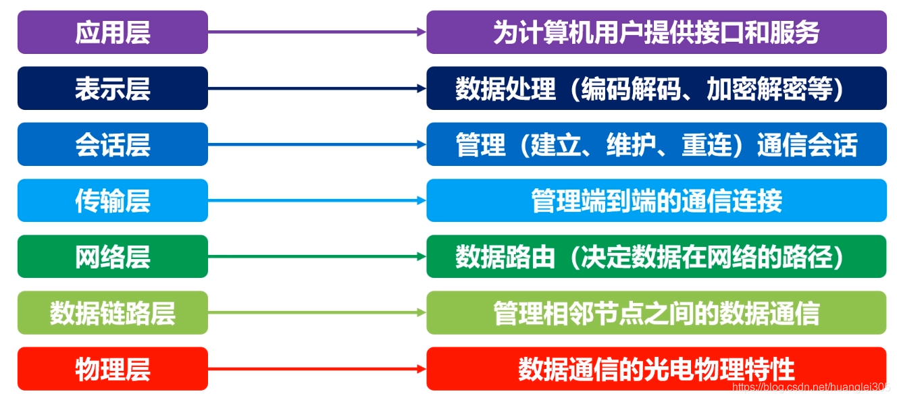
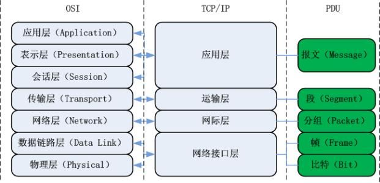

## 什么是HTTP，它的用途是什么？

HTTP（HyperText Transfer Protocol，超文本传输协议）是一种用于在互联网上进行数据通信的应用层协议。它基于 TCP/IP 协议栈工作，通常使用 TCP 作为传输层协议。HTTP 的主要作用是规定了客户端（例如浏览器）和服务器之间的请求和响应的格式与规则，从而实现数据的交换。

HTTP 的主要用途是：

1. **资源获取**：客户端可以通过 HTTP 向服务器发送请求，获取 HTML、CSS、JavaScript、图片、视频等各种资源，以便呈现和运行网页或其他应用。
2. **数据提交**：客户端可以通过 HTTP 将数据提交给服务器，例如表单提交、文件上传等。
3. **API 交互**：客户端和服务器可以通过 HTTP 进行 API 交互，以便在前后端之间传递数据。常见的数据格式包括 JSON 和 XML。

HTTP 协议的特点：

1. **无状态**：HTTP 是无状态的，意味着服务器不会存储与客户端之间交互的信息。为了实现有状态的会话，可以使用 Cookie 和 Session 等技术。
2. **简单快速**：HTTP 协议简单，易于实现。客户端和服务器之间的请求和响应报文格式统一，便于解析和处理。
3. **可扩展**：HTTP 允许自定义请求头和响应头，可以根据需要扩展协议的功能。
4. **明文传输**：HTTP 协议本身不提供数据加密功能，所有数据以明文形式传输。为了提高数据安全性，可以使用 HTTPS（HTTP Secure，基于 SSL/TLS 的 HTTP）进行加密传输。

HTTP 协议包括一系列请求方法（如 GET、POST、PUT、DELETE 等），用于指定请求的类型和目的。此外，HTTP 协议还定义了一系列状态码，用于表示请求的结果和相关信息。

## TCP中三次握手和四次挥手的含义

在 TCP（传输控制协议）中，三次握手和四次挥手是用来建立和终止连接的重要过程。下面分别解释它们的含义：

**三次握手（Three-Way Handshake）**：

三次握手是建立 TCP 连接的过程，确保数据传输的可靠性和连接的双向通信。这个过程包含三个步骤：

1. 客户端向服务器发送一个 SYN（同步）报文，表示客户端希望建立连接。报文中包含一个随机生成的序列号（Sequence Number）。
2. 服务器收到 SYN 报文后，回复一个 SYN+ACK（同步确认）报文，其中 ACK 的值为客户端序列号加一。同时，服务器也会发送一个自己的随机序列号。
3. 客户端收到 SYN+ACK 报文后，发送一个 ACK（确认）报文给服务器，其中 ACK 的值为服务器序列号加一。

完成这三个步骤后，客户端和服务器之间的 TCP 连接就建立好了，可以进行双向通信。

**四次挥手（Four-Way Handshake）**：

四次挥手是终止 TCP 连接的过程。当数据传输完成后，客户端和服务器需要通过四次挥手来关闭连接。这个过程包含四个步骤：

1. 客户端发送一个 FIN（完成）报文给服务器，表示客户端已完成数据发送。
2. 服务器收到 FIN 报文后，回复一个 ACK（确认）报文给客户端，表示已收到客户端的关闭请求。此时，客户端到服务器的连接被关闭，但服务器到客户端的连接仍然存在。
3. 当服务器完成数据发送后，也会发送一个 FIN 报文给客户端，表示服务器准备关闭连接。
4. 客户端收到服务器的 FIN 报文后，回复一个 ACK 报文给服务器，表示已收到服务器的关闭请求。经过一段时间（通常为 2MSL，即最长报文段寿命的两倍）后，客户端关闭与服务器的连接。

完成这四个步骤后，客户端和服务器之间的 TCP 连接就被完全关闭了。

## TCP提供了什么服务？

传输控制协议（TCP，Transmission Control Protocol）是一种面向连接的、可靠的、基于字节流的传输层通信协议。它为应用程序之间提供可靠的数据传输服务。TCP在Internet协议族中被广泛应用，与网络层协议IP（Internet Protocol）共同组成TCP/IP协议簇。

TCP提供的服务包括：

1. 面向连接：TCP在数据传输前建立一个连接。连接的建立、维护和终止都由TCP管理。这种面向连接的方式使得TCP适用于需要可靠通信的应用。
2. 可靠传输：TCP通过使用确认机制、重传机制和错误校验来确保数据的可靠传输。如果数据包丢失或损坏，TCP会自动重发数据包，从而保证数据的完整性和正确性。
3. 流量控制：TCP使用滑动窗口机制来实现流量控制，确保接收方的缓冲区不会被发送方的数据溢出。这样，发送方和接收方可以根据自身处理能力和网络状况动态调整传输速率，提高传输效率。
4. 拥塞控制：为了防止网络拥塞，TCP使用拥塞控制算法来调整发送数据的速率。当网络出现拥塞时，TCP会减少发送速率，避免网络拥塞进一步恶化。当网络恢复正常时，TCP会逐渐提高发送速率。
5. 数据排序：TCP会为每个数据包分配一个序号，接收方可以根据序号重新组合数据包，从而确保数据按正确顺序传输。
6. 复用与分用：TCP允许多个应用程序在同一台主机上通过不同的端口共享网络资源。这意味着多个应用程序可以在同一时间使用TCP进行数据传输，而不会互相干扰。

## Websocket与Ajax的区别？

WebSocket 和 Ajax 是两种不同的 Web 技术，它们在实现客户端与服务器之间通信时有一些区别。以下是它们之间的主要区别：

1. **连接方式**：
   - WebSocket：WebSocket 是一种全双工通信协议，建立连接后，客户端和服务器之间可以同时进行数据发送和接收。WebSocket 连接在建立后会保持连接状态，直至显式断开连接。
   - Ajax：Ajax（Asynchronous JavaScript and XML）是一种基于 HTTP 协议的异步请求技术。每次 Ajax 请求都需要建立一个新的 HTTP 连接，请求完成后连接会被关闭。因此，Ajax 是一种基于请求-响应模式的半双工通信方式。
2. **实时性**：
   - WebSocket：由于 WebSocket 是全双工通信，服务器可以在任何时候主动向客户端发送数据，因此实时性较强，适用于实时通信、在线游戏等场景。
   - Ajax：由于 Ajax 基于请求-响应模式，服务器不能主动向客户端发送数据，客户端需要定期发起请求以获取更新。因此，实时性相对较弱，适用于非实时的数据获取和更新。
3. **开销和性能**：
   - WebSocket：WebSocket 在建立连接后会保持连接状态，因此减少了频繁建立和断开连接的开销。同时，WebSocket 使用自己的二进制分帧格式进行数据传输，帧头较小，数据传输效率较高。
   - Ajax：每次 Ajax 请求都需要建立新的 HTTP 连接，这会导致一定的性能开销。另外，HTTP 协议的请求和响应头部较大，相对降低了数据传输效率。

总结：WebSocket 适用于实时性要求较高、需要双向通信的场景，而 Ajax 更适用于传统的 Web 应用，用于获取和更新数据。根据实际应用需求，可以选择合适的技术进行通信。

## HTTP1.0、HTTP1.1、HTTP2.0之间有什么区别

1. **HTTP/1.0**:
   - **无连接**：每个 HTTP 请求打开一个新的连接，请求结束后立即关闭连接。
   - **无状态**：每个请求都是独立的，服务器不保存之前的请求信息。
   - **缓存**：使用简单的 `Pragma: no-cache` 来避免缓存。

2. **HTTP/1.1**:
   - **长连接**：引入了持久连接，这意味着多个 HTTP 请求和响应可以在一个连接中连续发送，避免了为每个请求都建立新连接的开销。这是通过 `Connection: keep-alive` 头来实现的。
   - **管线化**：请求可以同时被发送，但是服务器必须按照它们接收到的顺序来逐一响应。
   - **缓存控制**：更加详细和精确的缓存头，如 `Cache-Control`，提供了更好的缓存管理。
   - **主机头的要求**：允许多个域名解析到同一 IP 地址，从而使虚拟主机成为可能。
   - **错误通知**：增加了更多的状态码和更丰富的错误信息。

3. **HTTP/2**:
   - **二进制协议**：不再是像 HTTP/1.x 那样的文本协议，而是一个二进制协议。这使得协议的解析、网络传输更高效。
   - **多路复用**：允许多个请求和响应在一个连接上同时并行交换，解决了 HTTP/1.1 中的“线头阻塞”问题。
   - **优先级和权重**：可以为请求设置优先级和权重，使得重要的请求得到更快的响应。
   - **服务器推送**：服务器可以对客户端“推送”资源，即使客户端尚未请求。
   - **首部压缩**：使用 HPACK 压缩，减少了请求和响应的大小。
   - **更强的流控制**：为每一个流提供了流控制机制。

## HTTP/2相比HTTP/1.1新增了什么

HTTP/2 是 HTTP/1.1 的升级版本，旨在解决 HTTP/1.1 中的一些性能问题，提高网络传输的效率。HTTP/2 相比于 HTTP/1.1 主要有以下新增特性：

1. **二进制分帧**：HTTP/2 将数据以二进制格式进行传输，请求和响应被分解为更小的帧，每个帧有自己的类型和标识符。这使得数据传输更加高效，易于解析。
2. **多路复用**：HTTP/2 允许在同一个 TCP 连接上同时发送和接收多个请求和响应，避免了 HTTP/1.1 中的队头阻塞问题。这样可以提高页面加载速度，减少网络延迟。
3. **头部压缩**：HTTP/2 使用 HPACK 压缩算法对请求和响应头部进行压缩，减小了传输数据的大小，从而降低了传输延迟。
4. **服务器推送**：HTTP/2 服务器可以主动将一些尚未被客户端请求的资源推送给客户端，以便客户端在需要时立即使用，提高了资源加载速度。

## HTTP/3相比HTTP/2解决了哪些问题？

HTTP/3 是互联网工程任务组（IETF）制定的新一代 HTTP（超文本传输协议）标准，它基于 QUIC 协议（快速 UDP 互联网连接），旨在解决 HTTP/2 存在的一些问题，提高网络性能和安全性。相较于 HTTP/2，HTTP/3 主要解决了以下问题：

1. 首部阻塞（Head-of-line blocking）：在 HTTP/2 中，多个请求和响应通过同一个 TCP 连接进行多路复用。由于 TCP 是面向连接的、可靠的传输协议，要求数据按顺序到达，当其中一个数据包丢失或延迟时，整个连接的其他数据包必须等待，直到丢失的数据包被重新传输并到达。这种现象被称为首部阻塞。HTTP/3 采用基于 UDP 的 QUIC 协议，它允许单独处理每个数据流，从而消除了首部阻塞问题。
2. 连接建立延迟：HTTP/2 在建立 TCP 连接之后，还需要通过 TLS 握手建立安全连接。这意味着需要多次往返才能完成连接建立。而 HTTP/3 使用 QUIC 协议，它将传输层（TCP）和安全层（TLS）整合在一起，从而减少了连接建立所需的往返次数。对于已经与服务器建立过连接的客户端，QUIC 甚至可以实现 0-RTT（零往返时间）连接建立，大幅降低了延迟。
3. 更好的网络路径迁移：当客户端或服务器的 IP 地址发生变化时（如移动设备在 Wi-Fi 和移动网络之间切换），TCP 连接可能中断，需要重新建立。HTTP/3 的 QUIC 协议提供了内置的连接迁移特性，允许在 IP 地址变化时保持连接状态，减少中断和延迟。
4. 拥塞控制和恢复：由于 HTTP/3 使用 QUIC 协议，它可以在单独的数据流上实现更细粒度的拥塞控制。这意味着当一个数据流受到网络拥塞影响时，其他数据流可以继续正常传输，不受影响。同时，QUIC 采用了更先进的丢包恢复机制，使得数据传输更加高效和可靠。

尽管 HTTP/3 有很多优势，但它目前仍在逐步推广和普及。浏览器和服务器需要支持 QUIC 协议，以便充分利用 HTTP/3 带来的改进。

## GET和POST请求的区别是什么？

GET和POST是HTTP协议中最常见的两种请求方法，它们之间的主要区别包括：

1. **请求参数的传递方式不同**：
   - GET请求的参数被附加到URL之后，以键值对的形式出现，各参数之间以&符号分割，如`http://example.com/page?param1=value1&param2=value2`。
   - POST请求的参数存储在请求体（Request Body）中。

2. **数据大小的限制不同**：
   - GET由于受URL长度限制，所以能传递的参数量相对有限。
   - POST请求由于参数在请求体中，理论上数据量没有限制，但实际上大小会受到WEB服务器的限制。

3. **安全性不同**：
   - GET请求的参数直接被包含在URL中，数据暴露给了用户，安全性较低，因此不适合传递敏感信息。
   - POST请求的参数在请求体中，用户无法在地址栏看到，安全性相对较高。

4. **可缓存**：
   - GET请求的结果通常可以被浏览器或代理服务器缓存。
   - POST请求的结果则通常不被缓存。

5. **幂等性和副作用**：
   - GET是幂等的，也就是说，无论调用一次还是多次，产生的效果是相同的。
   - POST不是幂等的，每次请求都可能导致不同的结果。

6. **请求的用途**：
   - GET通常用于请求服务器数据，例如网页浏览、图片加载等。
   - POST通常用于提交数据给服务器，例如表单提交、文件上传等。

虽然GET和POST是最常见的HTTP请求方法，但HTTP协议还定义了其他一些请求方法，如PUT、DELETE、PATCH、HEAD等，每种方法都有其特定的用途和语义。

## TCP与UDP有什么区别？

TCP（传输控制协议）和UDP（用户数据报协议）是互联网协议套件的两个主要协议，它们用于不同类型的网络服务，并具有各自的特点和用途。以下是它们的主要区别：

1. **连接类型**：
   - TCP是一种面向连接的协议，这意味着在数据交换之前，必须首先建立连接。一旦建立了连接，就会保持开放状态，直到所有数据传输完毕。TCP使用的是可靠的通信通道，确保数据的完整性和顺序。
   - UDP是一种无连接的协议，这意味着它不需要在发送数据之前建立连接。因此，UDP的通信通道是不可靠的，无法保证数据的完整性和顺序。

2. **速度和可靠性**：
   - TCP提供了一种可靠的数据传输方法，通过校验和、序列号、确认应答、重传机制和拥塞控制等机制，确保数据在网络中的正确无误的传输。但这些特性使得TCP相比UDP来说速度较慢。
   - UDP不提供数据可靠性，它只是简单地发送数据，不进行错误检查或数据恢复。这意味着如果网络出现问题，数据可能会丢失。但由于缺少了这些额外的特性，UDP的速度通常比TCP快。

3. **使用场景**：
   - TCP常用于需要高可靠性的应用，如Web浏览器、电子邮件服务、文件传输等。
   - UDP常用于对实时性要求较高、可接受一些数据丢失的应用，如流媒体、在线游戏和VoIP（网络电话）。

4. **报头长度**：
   - TCP的报头长度更长，最小为20字节，因为它包含了许多控制信息（如序列号和确认号）。
   - UDP的报头长度较短，只有8字节，因为它只提供基本的功能。

5. **流量控制和拥塞控制**：
   - TCP有内置的流量控制和拥塞控制机制，这使得TCP可以在网络繁忙时降低数据发送速度，以防止数据丢失。
   - UDP没有这些控制机制，所以在网络繁忙时可能会导致大量数据丢失。

总的来说，TCP和UDP都有它们各自的优势和使用场景。选择使用哪一个协议取决于特定的应用需求，如需要可靠性还是速度，以及对数据丢失的容忍度。

## 哪些协议底层使用UDP？

UDP（用户数据报协议）是一种无连接的网络通信协议，它不保证数据报的交付、顺序或校验，从而在通信速度和网络效率上优于TCP。以下是一些在底层使用UDP的协议：

1. **DNS (域名系统)**: DNS用于将互联网域名解析为IP地址。由于解析请求必须尽快完成，通常使用UDP作为传输协议。

2. **DHCP (动态主机配置协议)**: DHCP是一种网络协议，用于在网络上动态分配IP地址。因为DHCP请求需要快速处理，所以通常使用UDP。

3. **RTP (实时传输协议)**: RTP用于实时传输音频和视频数据。RTP通常与RTCP (RTP 控制协议)一起使用，用于媒体流的同步和质量反馈。RTP使用UDP，因为对于实时媒体流来说，速度和效率比确保每个包的交付更重要。

4. **SNMP (简单网络管理协议)**: SNMP用于管理和监控网络设备。SNMP消息需要快速发送并响应，因此使用UDP。

5. **NTP (网络时间协议)**: NTP用于在网络中同步时钟。NTP消息需要快速交付，所以通常使用UDP。

6. **QUIC (快速UDP互联网连接)**: QUIC是一种多路复用的传输层协议，用于在HTTP/3中替代TCP。QUIC使用UDP，以减少连接和重新传输的延迟。

7. **VoIP (语音 over IP)**: VoIP技术，如Skype和一些其他的互联网电话应用，使用UDP进行音频数据传输，因为它们更关心实时性，而不是数据的完整性。

## HTTP中，get、post、put、delete有什么区别？

HTTP中的GET、POST、PUT、DELETE是四种常见的HTTP方法（也称为“动词”），它们各自代表了不同的操作，通常用于RESTful Web服务中。以下是这四种方法的基本区别：

1. **GET**：
   - 用途：获取资源信息。
   - 安全性：GET是安全的，这意味着它只是获取信息并不改变资源状态。
   - 幂等性：GET是幂等的，这意味着多次执行同一GET请求，结果都是一样的。
   - 数据传输：参数包含在URL中，因此数据量有限，并且可能被记录在日志中。
   - 缓存：GET请求的响应是可以被缓存的。
   - 示例：访问一个网页或获取某个项目的详细信息。
2. **POST**：
   - 用途：提交数据并创建新资源。
   - 安全性：POST不是安全的，因为它可能改变资源的状态。
   - 幂等性：POST不是幂等的，因为重复发送同一个POST请求可能会有不同的效果（例如，重复创建相同的资源）。
   - 数据传输：参数不在URL中，而是在请求体中。因此，可以发送大量的数据。
   - 示例：填写并提交一个表单。
3. **PUT**：
   - 用途：更新现有资源或创建新资源。
   - 安全性：PUT不是安全的。
   - 幂等性：PUT是幂等的，重复执行同一PUT请求应该总是产生相同的结果。
   - 数据传输：数据在请求体中。
   - 示例：更新一个项目的详细信息。
4. **DELETE**：
   - 用途：删除资源。
   - 安全性：DELETE不是安全的。
   - 幂等性：DELETE是幂等的，因为无论删除多少次，资源都已经被删除。
   - 数据传输：通常不带请求体，资源标识通常在URL中。
   - 示例：删除一个项目。

## SSL/TLS是如何握手的？

SSL（安全套接层）和TLS（传输层安全）协议用于在互联网上建立安全的、加密的通信连接。尽管TLS是SSL的后续版本，但在实际用语中，它们经常互换使用。TLS握手过程可以分为以下几个步骤：

1. 客户端发起连接：客户端（例如，浏览器）向服务器发起一个安全连接请求。这个请求包括客户端支持的TLS版本、支持的加密套件（加密算法和密钥交换方法的组合）以及一个随机数（ClientHello 随机数）。
2. 服务器响应：服务器从客户端提供的加密套件列表中选择一个加密套件，并向客户端返回服务器的证书（包含公钥和服务器身份信息）、选择的TLS版本和加密套件，以及一个随机数（ServerHello 随机数）。此外，如果需要客户端身份验证，服务器还会请求客户端的证书。
3. 证书验证：客户端验证服务器证书的有效性。证书应由受信任的证书颁发机构（CA）签名。这一步的目的是确保与客户端通信的服务器是可信的，防止中间人攻击。
4. 密钥交换：客户端使用服务器证书中的公钥加密一个新的随机数（称为 Pre-Master Secret），并将其发送给服务器。服务器使用其私钥解密 Pre-Master Secret。然后，客户端和服务器分别使用 ClientHello 随机数、ServerHello 随机数和 Pre-Master Secret，通过一个伪随机函数生成主密钥（Master Secret）。这个主密钥将用于之后的对称加密和解密操作。
5. 客户端和服务器协商参数：客户端和服务器根据主密钥生成一组加密参数（例如，对称密钥、初始化向量、消息验证码等），这些参数将用于保护后续的数据传输。
6. 客户端和服务器验证握手过程：客户端发送一个加密的 Finished 消息，服务器解密并验证消息的完整性。服务器也发送一个加密的 Finished 消息，客户端解密并验证。这一步的目的是确保双方已正确完成密钥交换和参数协商。
7. 加密数据传输：完成握手过程后，客户端和服务器使用协商的加密参数进行安全的数据传输。此时，所有传输的数据都是加密的，以确保其机密性和完整性。

TLS握手过程旨在在客户端和服务器之间建立一个安全、加密的通信通道，以保护数据在互联网上的传输。

## 数字证书里面主要包含什么信息？

数字证书，通常用于 SSL/TLS 通信和其他加密场景，是一个电子文档，用于证明公钥的所有权和身份。数字证书通常由认证机构 (CA) 签署。以下是数字证书中主要的包含的信息：

1. **主体信息（Subject）**：
   - **公钥（Public Key）**：该证书对应的公钥。
   - **主体的名称（Subject Name）**：通常为网站的域名或组织的名称。
   - **组织名称（Organization Name）**：证书持有者的组织或公司名称（例如，"OpenAI Inc."）。
   - **组织单位（Organizational Unit, OU）**：组织内的特定部门或单位。
   - **地理位置信息**：如国家（Country）、州/省（State/Province）、城市（Locality）等。

2. **颁发者信息（Issuer）**：
   - **颁发者名称（Issuer Name）**：签发该证书的证书认证机构 (CA) 的名称。
   - 和主体类似，可能还包括组织名称、组织单位、国家等信息。

3. **有效期（Validity Period）**：
   - **开始日期（Not Before）**：证书的有效开始日期。
   - **结束日期（Not After）**：证书的过期日期。

4. **序列号（Serial Number）**：颁发者给证书分配的唯一编号，用于识别。

5. **签名算法（Signature Algorithm）**：用于签署此证书的算法（如 RSA、ECDSA 或其他）。

6. **证书签名（Signature）**：CA 使用其私钥生成的证书的数字签名。这使得其他人可以使用 CA 的公钥来验证证书的真实性和完整性。

7. **扩展和约束（Extensions and Constraints）**：这些是可选的，但在许多证书中都有。它们为证书提供了额外的属性和规则。例如：
   - **Key Usage**：描述公钥可以用于什么（例如，数据加密、数字签名等）。
   - **Extended Key Usage**：进一步详细说明公钥的使用，如服务器身份验证、客户端身份验证等。
   - **Subject Alternative Name (SAN)**：除主体名称外，其他有效的名称（通常用于多域名或通配符证书）。
   - **Certificate Policies**：关于证书如何使用和 CA 如何管理证书的策略。

8. **版本（Version）**：证书的版本号。目前，最常见的版本是 v3。

当客户端（例如，web 浏览器）接收到数字证书时，它会使用相关 CA 的公钥来验证证书的签名，从而验证证书的真实性。此过程有助于确保在网络上进行的通信是安全和加密的。

## 常见的API设计规范有哪些？

确实，RESTful是API设计中的一种非常流行的设计风格，但并非唯一的设计规范。除了RESTful之外，还有一些其他的API设计规范和架构风格，包括：

1. **REST (Representational State Transfer)**：REST是一种软件架构风格，通常用于设计网络应用程序。RESTful API遵循一组约定，如使用HTTP方法（GET，POST，PUT，DELETE等），使用路径来表示资源，并在可能的情况下，使用HTTP状态代码来表示错误。RESTful API通常使用JSON进行数据传输。
2. **GraphQL**：GraphQL是一个开源的数据查询和操作语言，同时也是一个运行时系统，用于现有数据的查询。与REST不同，GraphQL允许客户端精确地获取它需要的数据，而无需获取额外的信息。这可以帮助解决RESTful设计中的过度获取和信息获取不足的问题。
3. **gRPC**：gRPC是一个高性能、开源的通用RPC框架，它由Google开发。gRPC提供了一种简单的方法来定义服务：客户端应用程序可以直接在服务器上调用方法，就像是本地对象一样，而不用考虑底层的网络通信细节。
4. **JSON-RPC和XML-RPC**：这两种都是远程过程调用(RPC)规范，它们允许在网络上的一台计算机（客户端）调用另一台计算机（服务器）上的方法或过程。JSON-RPC使用JSON来编码数据，而XML-RPC使用XML来编码数据。
5. **OData (Open Data Protocol)**：OData是一个用于构建和消费RESTful API的开放标准。使用OData，你可以通过简单的HTTP请求进行查询和操作数据。
6. **SOAP**：SOAP是一种基于XML的消息协议，用于在web服务中交换结构化的信息。SOAP可以与各种通信协议一起使用，包括HTTP、SMTP等。

以上都是常见的API设计规范和架构风格，每种都有其特点和用途，设计API时应根据具体需求和场景进行选择。

## 状态码

在Web开发中，状态码是用于表示HTTP请求响应状态的数字代码。虽然HTML5本身并不直接涉及HTTP状态码的定义，但它们是Web开发中不可或缺的一部分，特别是在使用HTML5构建的应用程序中与服务器进行交互时。

以下是一些常见的HTTP状态码及其描述（注意，这些状态码并非HTML5特有，而是HTTP标准的一部分）：

**1xx（信息性状态码）**

- **100 Continue**：客户端应当继续发送请求或忽略这个响应。

**2xx（成功状态码）**

- **200 OK**：请求成功。一般用于GET与POST请求。
- **201 Created**：请求已经被创建，且新的资源已经成功创建并完成了请求的URI已经随Location的头信息返回。
- **204 No Content**：服务器成功处理了请求，但不需要返回任何实体内容，并且希望返回更新了的元信息。

**3xx（重定向状态码）**

- **301 Moved Permanently**：请求的网页已永久移动到新位置。
- **302 Found**（或**307 Temporary Redirect**）：临时重定向。

**4xx（客户端错误状态码）**

- **400 Bad Request**：服务器无法理解请求的格式，客户端不应当尝试再次使用相同的内容发起请求。
- **401 Unauthorized**：请求未授权。
- **403 Forbidden**：服务器已经理解请求，但是拒绝执行它。
- **404 Not Found**：服务器无法根据客户端的请求找到资源（网页）。

**5xx（服务器错误状态码）**

- **500 Internal Server Error**：服务器内部错误，无法完成请求。
- **502 Bad Gateway**：作为网关或代理工作的服务器尝试执行请求时，从上游服务器接收到无效的响应。
- **503 Service Unavailable**：由于临时的服务器维护或者过载，服务器当前无法处理请求。

## http和https的区别

HTTP和HTTPS的主要区别体现在以下几个方面：

1. 安全性：
   - HTTP：以明文方式发送内容，不提供任何方式的数据加密。这意味着如果攻击者截取了Web浏览器和网站服务器之间的传输报文，就可以直接读懂其中的信息。因此，HTTP协议不适合传输一些敏感信息，如信用卡号、密码等支付信息。
   - HTTPS：在HTTP的基础上加入了SSL/TLS协议，依靠证书来验证服务器的身份，并为浏览器和服务器之间的通信加密。HTTPS协议的主要作用包括建立一个信息安全通道来保证数据传输的安全以及确认网站的真实性。
2. 默认端口：
   - HTTP：默认使用80端口。
   - HTTPS：默认使用443端口。
3. 连接方式：
   - HTTP：连接很简单，是无状态的。
   - HTTPS：由SSL/TLS+HTTP协议构建的可进行加密传输、身份认证的网络协议，比HTTP协议更安全。
4. 网站申请流程：
   - HTTP：不需要申请证书。
   - HTTPS：需要到CA申请证书，一般免费证书较少，因而需要一定费用。
5. 性能影响：
   - HTTPS：虽然增加了数据传输的安全性，但其握手阶段比较费时，可能会使页面的加载时间延长近50%，并增加10%到20%的耗电。此外，HTTPS连接缓存不如HTTP高效，会增加数据开销和功耗。
6. 应用场景：
   - HTTP：适用于不需要高度安全性的数据传输场景，如简单的网页浏览等。
   - HTTPS：广泛用于需要安全敏感的通讯场景，如交易支付、个人信息登录等。
7. 加密技术：
   - HTTPS协议通过数字证书、加密算法、非对称密钥等技术完成互联网数据传输加密，实现互联网传输安全保护。其安全基础是SSL/TLS协议。

总结来说，HTTPS相较于HTTP在安全性方面有了极大的提升，通过加密和身份验证机制确保了数据传输的机密性和完整性。然而，HTTPS也带来了一定的性能开销和额外的费用。因此，在选择使用HTTP还是HTTPS时，需要根据实际的应用场景和需求进行权衡。

## SSL/TLS是什么？

SSL/TLS是一种用于保护网络通信的协议，它通过加密和身份验证机制确保数据在传输过程中的安全性和完整性。以下是关于SSL/TLS的详细解释：

一、定义

1. SSL（Secure Sockets Layer，安全套接字层）：是Netscape公司设计的一套协议，用于在应用程序（如浏览器）和Web服务器之间建立加密通信。它位于可靠的面向连接的网络层协议和应用层协议之间，是一种身份验证和加密的机制。
2. TLS（Transport Layer Security，传输层安全性）：是SSL的继任者，由IETF（Internet Engineering Task Force，互联网工程任务组）在SSL 3.0基础上设计。TLS提供了与SSL类似的功能，但更加安全，并包含更多的加密算法和身份验证机制。

二、工作原理

SSL/TLS协议的工作原理主要分为两个阶段：握手阶段和数据传输阶段。

1. 握手阶段：
   - 客户端向服务器发送加密通信请求。
   - 服务器回应并发送数字证书，该证书包含服务器的公钥和其他信息，用于证明服务器的身份。
   - 客户端验证数字证书的有效性，如果证书有效，则生成一个随机数，并使用服务器的公钥加密后发送给服务器。
   - 服务器使用自己的私钥解密客户端发送的随机数，并使用该随机数和自己的私钥生成会话密钥。
   - 双方确认握手过程完成，并开始使用会话密钥进行加密通信。
2. 数据传输阶段：
   - 使用会话密钥对数据进行加密和解密。发送方使用会话密钥对数据进行加密，并通过SSL/TLS协议传输给接收方。
   - 接收方使用会话密钥解密数据，确保数据的完整性和安全性。

三、特点

1. 加密性：SSL/TLS使用对称加密和非对称加密相结合的方式，保证了通信的安全性和数据的完整性。
2. 身份验证：通过数字证书和公钥/私钥机制，SSL/TLS可以验证通信双方的身份，防止中间人攻击。
3. 完整性：SSL/TLS使用消息认证码（MAC）等技术，确保传输数据的完整性和防止篡改。

四、应用场景

SSL/TLS广泛应用于需要保护数据传输安全性和完整性的场景，如：

1. Web浏览器与服务器之间的安全通信（如HTTPS协议）。
2. 电子邮件服务的加密传输（如SMTPS、IMAPS）。
3. 在线支付系统的安全保护。
4. 虚拟专用网络（VPN）的加密通信。
5. API接口的安全通信。
6. 数据库系统的加密连接等。

总之，SSL/TLS是一种重要的网络通信安全协议，它通过加密和身份验证机制确保数据在传输过程中的安全性和完整性。

## OSI模型和TCP/IP四层模型

**物理层（Physical Layer）**：负责实际的物理连接，如电缆、光纤等，以及数据的传输和接收。它关注的是比特流的传输。

**数据链路层（Data Link Layer）**：在物理层的基础上提供数据传输的可靠性。它负责建立、维护和解除物理链路，并对传输的数据进行错误检测和修正。

**网络层（Network Layer）**：负责数据包的路由和转发，确定数据包的路径，以及处理网络拥塞和路由选择等问题。

**传输层（Transport Layer）**：负责端到端的通信管理和错误恢复。它确保数据在网络中完整无误地传输。

**会话层（Session Layer）**：管理应用程序之间的会话，包括会话的建立、维护和终止。

**表示层（Presentation Layer）**：确保信息以通用的格式传输，进行数据的格式转换、数据加密和解密。

**应用层（Application Layer）**：直接为用户的应用程序提供服务，如Web浏览器、电子邮件客户端等。

## 为什么不用 cookie 用 token

在Web开发中，选择使用令牌（token）而不是cookie来管理用户会话和身份验证有多个原因。以下是一些主要的原因：

1. 无状态（Stateless）：
   - 使用令牌通常意味着你的应用程序是无状态的，因为所有的认证信息都包含在令牌本身中，而不需要在服务器上存储会话信息。这使得应用程序更容易扩展，因为服务器不需要跟踪每个用户的会话状态。
2. 安全性：
   - Cookie通常存储在客户端的浏览器中，并且可以通过HTTP请求自动发送。这可能导致安全问题，例如跨站脚本攻击（XSS），因为攻击者可能会尝试窃取或篡改cookie。
   - 令牌（特别是JWT，即JSON Web Tokens）通常存储在HTTP请求的头部（如`Authorization`头），这使得它们更难以被窃取。此外，令牌可以包含签名，用于验证其完整性和真实性。
3. 灵活性：
   - 令牌可以包含有关用户的自定义信息，这些信息可以在不需要再次查询数据库的情况下使用。
   - 令牌可以在多个服务和应用程序之间共享，这使得它们成为微服务架构和分布式系统中的理想选择。
4. 过期和撤销：
   - 虽然cookie可以设置过期时间，但撤销一个已经发布的cookie相对困难，因为你需要更改存储在客户端的cookie。
   - 令牌通常具有较短的过期时间，并且可以通过黑名单或白名单机制进行撤销。当令牌过期或需要撤销时，服务器只需简单地停止接受该令牌即可。
5. 跨域（CORS）：
   - 由于cookie的发送受到同源策略的限制，因此跨域身份验证可能变得更加复杂。而令牌通常存储在HTTP请求头中，可以更容易地跨域发送。
6. 移动和桌面应用：
   - 对于移动和桌面应用程序，使用令牌而不是cookie更为常见，因为这些应用程序通常不依赖于浏览器来管理cookie。
7. RESTful API：
   - RESTful API通常设计为无状态的，以便更好地支持缓存、可伸缩性和可靠性。使用令牌与RESTful API的设计原则相契合。

当然，这并不是说cookie在所有情况下都是不好的选择。在某些情况下，cookie可能是更合适的选择，特别是当你需要跨多个请求和页面持久化会话信息时。但是，在需要高安全性、可扩展性或跨域身份验证的场景中，令牌通常是一个更好的选择。